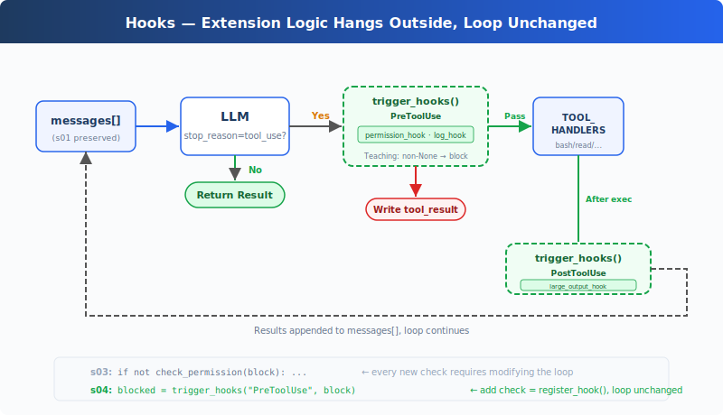

# learning04: Hooks — Hang on the Loop, Don't Write into It

learning01 → learning02 → learning03 → `learning04` → [learning05](../learning05_todo_write/) → learning06 → ... → learning20
> *"Hang on the loop, don't write into it"* — Hooks inject extension logic before and after tool execution.
>
> **Harness Layer**: Hooks — extension points that don't invade the loop.

---

## The Problem

learning03's Agent has permission checks. But every new check — "log every bash call", "auto git add after writes" — means modifying `agent_loop()` itself.

The loop quickly starts to look like this:

```python
def agent_loop(messages):
    while True:
        # ... LLM call ...
        for block in response.content:
            if block.type != "tool_use":
                continue
            log_to_file(block)          # added one line
            check_permission(block)     # added one line
            notify_slack(block)         # added one more line
            output = execute(block)
            auto_git_add(block)         # yet another line
            # ... the loop is getting unreadable
```

What you want to extend is the Agent's behavior. But what you're editing is the loop itself.

The loop should stay as stable core logic. Extension behavior should hang on the outside.

---

## The Solution



learning03's loop and permission logic are fully preserved. The only structural change is moving `check_permission()` out of the loop body and onto a hook. The loop no longer directly calls any check function. Instead, it calls `trigger_hooks("PreToolUse", block)`, and the registry decides what to run.

Four events cover a complete agent cycle:

| Event | Trigger Timing | Typical Use |
|-------|---------------|-------------|
| UserPromptSubmit | After user input, before entering the LLM | Input validation, context injection |
| PreToolUse | Before tool execution | Permission checks, logging |
| PostToolUse | After tool execution | Side effects, output inspection |
| Stop | When the loop is about to exit | Cleanup, force continuation |

Extensions are added via `register_hook()`. The loop only calls `trigger_hooks()`.

---

## How It Works

**Hook registry**: a dict mapping event names to callback lists.

```python
HOOKS = {
    "UserPromptSubmit": [],
    "PreToolUse": [],
    "PostToolUse": [],
    "Stop": [],
}

def register_hook(event: str, callback):
    HOOKS[event].append(callback)

def trigger_hooks(event: str, *args):
    for callback in HOOKS[event]:
        result = callback(*args)
        if result is not None:
            return result
    return None
```

In the teaching version, `PreToolUse` returning non-`None` means "block execution." `Stop` returning non-`None` means "continue instead of exiting." `UserPromptSubmit` and `PostToolUse` return values are ignored.

**UserPromptSubmit** runs after user input, before the LLM call. CC can intercept or modify input here. The teaching version only logs:

```python
def context_inject_hook(query: str) -> str | None:
    print(f"\033[90m[HOOK] UserPromptSubmit: working in {WORKDIR}\033[0m")
    return None

register_hook("UserPromptSubmit", context_inject_hook)
```

In the main loop, it is triggered right after user input:

```python
query = input("learning04 >> ")
trigger_hooks("UserPromptSubmit", query)
history.append({"role": "user", "content": query})
agent_loop(history)
```

**PreToolUse / PostToolUse** wrap tool execution. learning03's permission check becomes a `PreToolUse` hook, plus a logging hook and a large-output reminder:

```python
# PreToolUse: permission check (learning03 logic moved into a hook)
def permission_hook(block):
    if block.name == "bash":
        for pattern in DENY_LIST:
            if pattern in block.input.get("command", ""):
                return "Permission denied by deny list"
    if block.name in ("write_file", "edit_file"):
        path = block.input.get("path", "")
        if not (WORKDIR / path).resolve().is_relative_to(WORKDIR):
            choice = input("   Allow? [y/N] ").strip().lower()
            if choice not in ("y", "yes"):
                return "Permission denied by user"
    return None

# PreToolUse: logging
def log_hook(block):
    print(f"[HOOK] {block.name}(...)")

# PostToolUse: large output reminder
def large_output_hook(block, output):
    if len(str(output)) > 100000:
        print(f"[HOOK] ⚠ Large output from {block.name}")

register_hook("PreToolUse", permission_hook)
register_hook("PreToolUse", log_hook)
register_hook("PostToolUse", large_output_hook)
```

**Stop** runs when the loop is about to exit (`stop_reason != "tool_use"`). The teaching version prints a summary:

```python
def summary_hook(messages: list) -> str | None:
    tool_count = sum(
        1 for m in messages
        for b in (m.get("content") if isinstance(m.get("content"), list) else [])
        if isinstance(b, dict) and b.get("type") == "tool_result"
    )
    print(f"\033[90m[HOOK] Stop: session used {tool_count} tool calls\033[0m")
    return None

register_hook("Stop", summary_hook)
```

In `agent_loop()`, it is triggered before exit:

```python
if response.stop_reason != "tool_use":
    force = trigger_hooks("Stop", messages)
    if force:
        messages.append({"role": "user", "content": force})
        continue
    return
```

**Only one core change inside the loop**: learning03 directly called `check_permission(block)`. learning04 replaces that with `trigger_hooks("PreToolUse", block)`:

```python
for block in response.content:
    if block.type != "tool_use":
        continue

    blocked = trigger_hooks("PreToolUse", block)
    if blocked:
        results.append({
            "type": "tool_result",
            "tool_use_id": block.id,
            "content": str(blocked),
        })
        continue

    handler = TOOL_HANDLERS.get(block.name)
    output = handler(**block.input) if handler else f"Unknown: {block.name}"

    trigger_hooks("PostToolUse", block, output)

    results.append({
        "type": "tool_result",
        "tool_use_id": block.id,
        "content": output,
    })
```

The loop now only knows how to trigger hooks. All extension logic lives in hook callbacks.

---

## Changes from learning03

| Component | Before (learning03) | After (learning04) |
|-----------|-------------|-------------|
| Extension method | `check_permission()` hardcoded in the loop | `HOOKS` registry + `trigger_hooks()` |
| New functions | — | `register_hook`, `trigger_hooks` |
| Hook callbacks | — | `context_inject_hook`, `permission_hook`, `log_hook`, `large_output_hook`, `summary_hook` |
| Loop | Directly calls `check_permission()` | Calls `trigger_hooks("PreToolUse", ...)` |
| Exit control | None | `trigger_hooks("Stop", ...)` can prevent exit |
| Input interception | None | `trigger_hooks("UserPromptSubmit", ...)` runs before the LLM |

---

## Try It

```sh
cd learn-claude-code
python learning04_hooks/code.py
```

Try these prompts:

1. `Read the file README.md` (should pass directly, watch the hook logs)
2. `Create a file called test.txt` (after creation, notice `PostToolUse`)
3. `Delete all temporary files in /tmp` (bash + rm should trigger the permission hook)

What to watch for: Before each tool execution, do you see `[HOOK]` logging? When a tool is blocked, is the block coming from a hook or from hardcoded loop logic?

---

## What's Next

The Agent can now extend behavior without cluttering the loop. But does it ever stop to think: what should happen first, and what should happen next? Given a complex task, does it just start acting, or does it plan first?

→ learning05 TodoWrite: Give the Agent a planning tool. Make a list first, then execute.

<details>
<summary>Dive into CC Source Code</summary>

> The following is based on a review of CC source code `toolHooks.ts`, `hooks.ts`, `stopHooks.ts`, and `coreTypes.ts`.

### 1. Hook Events: Not 4, but 27

The teaching version shows only 4 events. CC actually defines 27 hook events in `coreTypes.ts`.

| Category | Events |
|----------|--------|
| Tool-related | `PreToolUse`, `PostToolUse`, `PostToolUseFailure` |
| Session-related | `SessionStart`, `SessionEnd`, `Stop`, `StopFailure`, `Setup` |
| User interaction | `UserPromptSubmit`, `Notification`, `PermissionRequest`, `PermissionDenied` |
| Sub-agents | `SubagentStart`, `SubagentStop` |
| Compaction-related | `PreCompact`, `PostCompact` |
| Team-related | `TeammateIdle`, `TaskCreated`, `TaskCompleted` |
| Other | `Elicitation`, `ElicitationResult`, `ConfigChange`, `WorktreeCreate`, `WorktreeRemove`, `InstructionsLoaded`, `CwdChanged`, `FileChanged` |

The teaching version keeps only 4 because they cover the critical points of one agent cycle: input, before execution, after execution, and exit.

### 2. HookResult Has Many Fields

CC's `HookResult` includes many fields. Common ones include:

| Field | Type | Purpose |
|-------|------|---------|
| `message` | Message | Optional UI message |
| `blockingError` | HookBlockingError | Blocking error injected into the conversation |
| `outcome` | success/blocking/non_blocking_error/cancelled | Execution result |
| `preventContinuation` | boolean | Prevent subsequent execution |
| `stopReason` | string | Stop reason description |
| `permissionBehavior` | allow/deny/ask/passthrough | Permission decision from hook |
| `updatedInput` | Record | Modified tool input |
| `additionalContext` | string | Additional context |
| `updatedMCPToolOutput` | unknown | Modified MCP tool output |

### 3. Important Invariant: Hook `allow` Cannot Override deny/ask Rules

In CC, if a hook returns `allow`, that does **not** bypass the normal permission system. Settings-based deny/ask rules are still enforced. This prevents user-defined hooks from accidentally weakening safety policy.

The teaching version omits this extra layer. Here, a non-`None` return simply interrupts or redirects control flow.

### 4. `stopHookActive` Prevents Infinite Stop Loops

CC's Stop hooks include an infinite-loop prevention mechanism. When a Stop hook causes a blocking error, the loop re-enters with `stopHookActive: true`, and Stop hooks do not run again immediately. This avoids repeating the same stop failure forever.

The teaching version omits this because its Stop hook only demonstrates simple continuation behavior.

### 5. `hook_stopped_continuation`

When a `PostToolUse` hook returns `preventContinuation: true`, CC produces a `hook_stopped_continuation` attachment. The query loop detects that and exits gracefully. This is how hooks can stop the Agent without crashing it.

### Teaching Simplifications Are Intentional

- 27 events → 4 core events
- Rich `HookResult` objects → simple return values
- Hook allow vs deny/ask invariant → omitted
- `stopHookActive` → omitted

These simplifications keep the core idea clear: hooks let you extend behavior without rewriting the loop.

</details>
