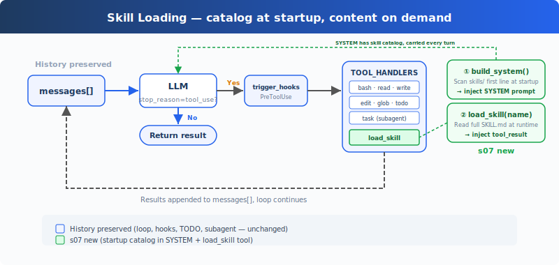

# learning07: Skill Loading — Load Only When Needed

learning01 → learning02 → learning03 → learning04 → learning05 → learning06 → `learning07` → learning08 → ... → learning20
> *"Load when needed, don't stuff the prompt"* — Keep only a lightweight skill catalog in the system prompt, and load full instructions through a tool only when necessary.
>
> **Harness Layer**: Knowledge loading — inject specialized guidance on demand instead of carrying everything every turn.

---

## The Problem

By learning06, the Agent can plan with `todo_write` and delegate with `task`. But it still has no good way to use large bodies of project-specific knowledge.

Imagine your workspace includes:

- a frontend component guide,
- a SQL style guide,
- an API design playbook,
- and a deployment runbook.

A naive solution is to paste all of that into the system prompt.

```python
SYSTEM = (
    f"You are a coding agent. "
    + open("docs/frontend.md").read()
    + open("docs/sql.md").read()
    + open("docs/api.md").read()
)
```

That works technically, but it is wasteful. Every model call carries all of that text, even when the current task only needs one small part of it.

The result is predictable:

- unnecessary token cost,
- more crowded context,
- weaker focus on the current task,
- and less room for actual work history.

The Agent needs access to knowledge, but not all knowledge all the time.

---

## The Solution



learning06's loop, hooks, `todo_write`, and subagent flow remain in place. The new addition is a `load_skill` tool plus a startup scan of the `skills/` directory.

The design has two layers:

| Layer | What it contains | When it appears | Cost |
|-------|------------------|-----------------|------|
| Catalog | Skill names + one-line descriptions | Injected into `SYSTEM` at startup | Small, carried every turn |
| Full content | Full `SKILL.md` text for one skill | Returned by `load_skill(name)` | Larger, paid only when needed |

This gives the model two abilities:

1. always know **which skills exist**,
2. request **full instructions for one skill** only when the task requires it.

So the system prompt stays light, while specialized guidance remains available on demand.

---

## How It Works

### Step 1: Organize skills under `skills/`

Each skill lives in its own directory with a `SKILL.md` manifest.

```text
skills/
  agent-builder/SKILL.md
  code-review/SKILL.md
  mcp-builder/SKILL.md
  pdf/SKILL.md
```

### Step 2: Scan skills at startup

At process startup, the harness scans the `skills/` directory, reads each `SKILL.md`, and extracts metadata into a registry.

```python
SKILL_REGISTRY: dict[str, dict] = {}

def _scan_skills():
    if not SKILLS_DIR.exists():
        return
    for d in sorted(SKILLS_DIR.iterdir()):
        if not d.is_dir():
            continue
        manifest = d / "SKILL.md"
        if manifest.exists():
            raw = manifest.read_text(encoding="utf-8")
            meta, _ = _parse_frontmatter(raw)
            name = meta.get("name", d.name)
            desc = meta.get("description", raw.split("\n")[0].lstrip("#").strip())
            SKILL_REGISTRY[name] = {
                "name": name,
                "description": desc,
                "content": raw,
            }
```

This gives the harness a safe in-memory registry keyed by skill name.

### Step 3: Build the system prompt from the catalog

The Agent does not get full skill content by default. It only gets the catalog.

```python
def list_skills() -> str:
    return "\n".join(
        f"- **{s['name']}**: {s['description']}"
        for s in SKILL_REGISTRY.values()
    )

def build_system() -> str:
    catalog = list_skills()
    return (
        f"You are a coding agent at {WORKDIR}. "
        f"Skills available:\n{catalog}\n"
        "Use load_skill to get full details when needed."
    )
```

This is the cheap layer: enough context for discovery, but not enough to waste tokens on every turn.

### Step 4: Load full skill content only when needed

When the model decides it needs a skill, it calls `load_skill`.

```python
def load_skill(name: str) -> str:
    skill = SKILL_REGISTRY.get(name)
    if not skill:
        return f"Skill not found: {name}"
    return skill["content"]
```

The important detail is that lookup happens through `SKILL_REGISTRY`, not an arbitrary file path. That means the tool exposes named skills, not unrestricted filesystem access.

Once loaded, the skill content enters the conversation as a tool result. The Agent can then follow those instructions for the current task.

---

## Quick Reference

| Concept | One-Liner |
|---------|-----------|
| `skills/` | Directory containing one subdirectory per skill |
| `SKILL.md` | The full manifest and instructions for one skill |
| Catalog | Name + description list injected into `SYSTEM` |
| `load_skill(name)` | Returns the full content of one named skill |
| Registry lookup | Prevents path-based skill loading |

---

## Changes from learning06

| Component | Before (learning06) | After (learning07) |
|-----------|-------------|-------------|
| Tool count | 7 (bash, read, write, edit, glob, todo_write, task) | 8 (+load_skill) |
| Knowledge loading | None | Two-level loading: catalog now, full skill later |
| System prompt | Static task guidance | Dynamically includes a scanned skill catalog |
| Skill state | None | `SKILL_REGISTRY` built at startup |
| Parent/subagent loop | Subtasks only | Same loop, plus on-demand skill loading |

---

## Try It

```sh
cd learn-claude-code
python learning07_skill_loading/code.py
```

Try these prompts:

1. `What skills are available?`
2. `Load the code-review skill and follow it`
3. `I need to review a change. Load the right skill first, then summarize how you would apply it`

What to watch for: Does the Agent already know the available skills from the system prompt? Does it call `load_skill` only when it needs the full instructions? After loading, does the reply reflect the skill's guidance?

---

## What's Next

Skill loading keeps the prompt lean at the beginning of the task. But over time, the conversation can still accumulate old tool outputs, stale file contents, and no-longer-useful context.

So the next problem is not how to load knowledge — it is how to compress history after work has already happened.

→ learning08 Context Compact: reduce context pressure by compacting older conversation state.

<details>
<summary>Dive into CC Source Code</summary>

> The following is based on a review of Claude Code source files related to skill loading, including `loadSkillsDir.ts`, `SkillTool.ts`, `bundledSkills.ts`, and nearby command-loading logic.

### 1. The Teaching Version Uses One Skill Source

This chapter uses a single `skills/` directory. Real Claude Code supports multiple skill sources, including user-level, project-level, bundled, legacy command-based, and MCP-provided skills.

The simplified version keeps only one source because the core lesson is about **two-level loading**, not about the full discovery matrix.

### 2. Real SKILL.md Frontmatter Is Richer

The teaching version only needs basic metadata like `name` and `description`.

Production Claude Code supports many more frontmatter fields, such as:

- `when_to_use`
- `allowed-tools`
- `context`
- `model`
- `hooks`
- `paths`
- `user-invocable`

Those details matter in a full system, but they are intentionally omitted here so the loading pattern stays easy to understand.

### 3. Two-Level Loading Is the Important Part

The production implementation is more elaborate, but the architectural idea is the same:

1. build a compact list of available skills first,
2. expand the full skill text only when the model invokes the skill tool.

That is the real takeaway of this chapter.

### 4. The Teaching Tool Returns Inline Content Directly

Claude Code's production implementation has extra machinery around attachments, command expansion, and sometimes alternate execution paths.

The teaching version deliberately simplifies this to:

- registry scan at startup,
- one `load_skill` tool,
- full `SKILL.md` returned directly as the tool result.

That simplification makes the concept visible without needing the rest of the production framework.

</details>
