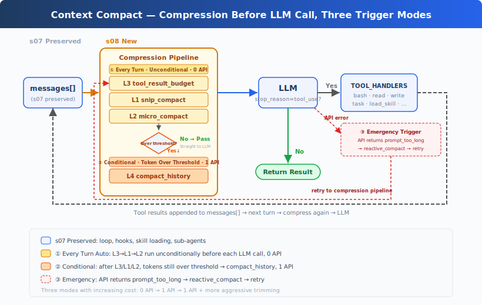
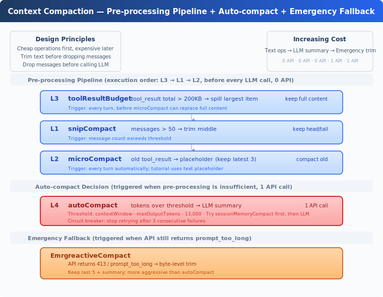

# learning08: Context Compact — Context Will Fill Up, Have a Way to Make Room

learning01 → learning02 → learning03 → learning04 → learning05 → learning06 → learning07 → `learning08` → learning09 → ... → learning20
> *"Context will fill up, so make room before it breaks"* — Add a multi-layer compaction pipeline so long-running work can continue inside a finite context window.
>
> **Harness Layer**: Context management — compact old conversation state before the prompt gets too large.

---

## The Problem

By learning07, the Agent can plan with `todo_write`, delegate with `task`, and load specialized instructions with `load_skill`.

But the conversation itself still only grows.

Every turn adds more material to `messages[]`:

- file contents from `read_file`,
- command output from `bash`,
- intermediate investigation notes,
- tool results that were useful five minutes ago but are irrelevant now.

That works for short sessions. On larger tasks, it fails for a simple reason: the model's context window is finite.

Eventually the Agent reaches a bad state:

- it has the right tools,
- it has already done useful work,
- but the next API call is rejected because the prompt is too large.

In practice, this often shows up as `prompt_too_long`.

So the next missing capability is not a new tool. It is a way to shrink history while keeping the important parts.

---

## The Solution



learning07's tool loop, hooks, subagent support, and skill loading stay in place. The new addition is a compaction pipeline that runs before model calls.

The design follows one rule:

**Cheap first, expensive last.**

That means:

1. try structural compaction that costs 0 extra API calls,
2. only ask the LLM to summarize when that is still not enough,
3. and keep an emergency fallback for `prompt_too_long` errors.

The teaching version uses four layers:

| Layer | Purpose | API cost |
|-------|---------|----------|
| `tool_result_budget` | Persist oversized tool outputs to disk | 0 |
| `snip_compact` | Trim old middle messages | 0 |
| `micro_compact` | Replace older tool results with placeholders | 0 |
| `compact_history` | Ask the LLM to summarize history | 1 |

There is also a reactive fallback: `reactive_compact`, used only after an API rejection.

---

## How It Works



### Step 1: Persist oversized tool results with `tool_result_budget`

A single large tool result can consume most of the prompt by itself.

For example, if the Agent reads several large files in one turn, the most recent user message may contain hundreds of kilobytes of `tool_result` content.

So the first pass looks only at the newest tool-result batch. If the total size exceeds a budget, the harness persists the largest results to disk under `.task_outputs/tool-results/` and leaves only a marker plus preview in context.

```python
def tool_result_budget(messages, max_bytes=200_000):
    last = messages[-1]
    blocks = [(i, b) for i, b in enumerate(last["content"])
              if b.get("type") == "tool_result"]
    total = sum(len(str(b.get("content", ""))) for _, b in blocks)
    if total <= max_bytes:
        return messages

    ranked = sorted(blocks, key=lambda p: len(str(p[1].get("content", ""))), reverse=True)
    for idx, block in ranked:
        if total <= max_bytes:
            break
        block["content"] = persist_large_output(block["tool_use_id"], str(block["content"]))
        total = recalculate_total(blocks)
    return messages
```

This matters because later layers may replace old content with placeholders. Large outputs need to be safely persisted before that happens.

### Step 2: Trim old middle conversation with `snip_compact`

Even when individual tool results are small, a long session can still accumulate too many messages.

The simplest structural fix is to keep:

- the very beginning of the conversation,
- the most recent tail,
- and replace the middle with a short placeholder.

```python
def snip_compact(messages, max_messages=50):
    if len(messages) <= max_messages:
        return messages
    keep_head, keep_tail = 3, max_messages - 3
    snipped = len(messages) - keep_head - keep_tail
    placeholder = {"role": "user",
                   "content": f"[snipped {snipped} messages from conversation middle]"}
    return messages[:keep_head] + [placeholder] + messages[-keep_tail:]
```

This removes stale turns without needing the model to understand them.

### Step 3: Replace older tool outputs with `micro_compact`

Even after message-level trimming, the remaining messages may still contain large old tool results.

So the next pass walks older `tool_result` blocks and keeps only the most recent few intact. Older ones get replaced with a short placeholder.

```python
KEEP_RECENT_TOOL_RESULTS = 3

def micro_compact(messages):
    tool_results = collect_tool_result_blocks(messages)
    if len(tool_results) <= KEEP_RECENT_TOOL_RESULTS:
        return messages
    for _, _, block in tool_results[:-KEEP_RECENT_TOOL_RESULTS]:
        if len(block.get("content", "")) > 120:
            block["content"] = "[Earlier tool result compacted. Re-run if needed.]"
    return messages
```

This is intentionally blunt. The teaching version does not try to semantically preserve every old output. If the Agent needs that content again, it can re-run the tool.

### Step 4: Summarize with `compact_history` when the prompt is still too large

The first three layers are cheap because they do not call the model.

But they are also dumb: they cannot decide which findings matter most.

If the estimated token count is still over the threshold, the harness switches to a real summarization step:

1. save the full transcript to `.transcripts/`,
2. ask the model for a summary of the important state,
3. replace the full message history with that summary.

```python
def compact_history(messages):
    transcript_path = write_transcript(messages)
    summary = summarize_history(messages)
    return [{"role": "user",
             "content": f"[Compacted]

{summary}"}]
```

This is the first expensive layer, so it is only used after cheaper compaction has already run.

The teaching version also includes a circuit breaker: after repeated compaction failures, it stops retrying instead of burning API calls forever.

### Step 5: Recover from `prompt_too_long` with `reactive_compact`

Sometimes compaction still loses the race.

If the API rejects a request with `prompt_too_long`, the harness uses a more aggressive emergency path:

- save the transcript,
- generate a summary,
- keep only that summary plus a short recent tail.

```python
def reactive_compact(messages):
    transcript = write_transcript(messages)
    summary = summarize_history(messages)
    tail = messages[-5:]
    return [{"role": "user",
             "content": f"[Reactive compact]

{summary}"}, *tail]
```

This fallback is not the normal path. It exists so the Agent can recover when proactive compaction was not enough.

### Step 6: Run the compaction pipeline before each turn

The loop now has a pre-processing stage before the normal model call.

```python
def agent_loop(messages):
    reactive_retries = 0
    while True:
        messages[:] = tool_result_budget(messages)
        messages[:] = snip_compact(messages)
        messages[:] = micro_compact(messages)

        if estimate_token_count(messages) > THRESHOLD:
            messages[:] = compact_history(messages)

        try:
            response = client.messages.create(...)
        except PromptTooLongError:
            if reactive_retries < MAX_REACTIVE_RETRIES:
                messages[:] = reactive_compact(messages)
                reactive_retries += 1
                continue
            raise
```

The order matters.

`tool_result_budget` must run before `micro_compact`, because placeholders should never overwrite large tool output before that output has a chance to be persisted.

---

## Quick Reference

| Concept | One-Liner |
|---------|-----------|
| `tool_result_budget` | Persist oversized recent tool outputs to disk before they dominate context |
| `snip_compact` | Remove old middle messages while keeping the beginning and recent tail |
| `micro_compact` | Replace older tool results with a short placeholder |
| `compact_history` | Use the LLM to summarize history when structural compaction is insufficient |
| `reactive_compact` | Emergency fallback after `prompt_too_long` |
| Core rule | Cheap first, expensive last |

---

## Changes from learning07

| Component | Before (learning07) | After (learning08) |
|-----------|-------------|-------------|
| Context management | None; history grows without bound | Multi-layer compaction pipeline |
| New functions | — | `tool_result_budget`, `snip_compact`, `micro_compact`, `compact_history`, `reactive_compact` |
| Tool count | 8 (bash, read_file, write_file, edit_file, glob, todo_write, task, load_skill) | 9 (+compact) |
| Loop structure | Model call, then tool execution | Pre-compaction stage before each model call |
| Failure handling | No prompt-length recovery path | Reactive compaction on `prompt_too_long` |

---

## Try It

```sh
cd learn-claude-code
python learning08_context_compact/code.py
```

Try these prompts:

1. `Read README.md, then read code.py, then read several other module READMEs`
2. `Read every file in learning08_context_compact/`
3. `Keep working with me for many turns and tell me when compaction happens`

What to watch for:

- Do older `tool_result` blocks get replaced with placeholders?
- When large outputs appear, are they persisted to disk?
- After a long session, does the Agent summarize history automatically?
- If the prompt becomes too large anyway, does the reactive fallback recover?

---

## What's Next

Compaction prevents long sessions from crashing, but it also throws away detail.

That creates the next question: what information should survive compaction and be remembered across time?

→ learning09 Memory: selectively retain important facts across compactions and sessions.

<details>
<summary>Dive into CC Source Code</summary>

> The following is based on a review of Claude Code source files related to compaction, including `compact.ts`, `autoCompact.ts`, `microCompact.ts`, and `query.ts`.

### 1. Teaching Order vs Layer Labels

For teaching clarity, this chapter names the layers as L1/L2/L3/L4. But the actual execution order is:

1. budget,
2. snip,
3. micro,
4. auto compact.

That ordering matches the implementation in Claude Code's query path: persist big outputs first, then trim structure, then collapse older tool results, and only then pay for summarization.

### 2. The Teaching Version Simplifies Several Production Mechanisms

The real Claude Code implementation contains more machinery than this chapter shows, including:

- more precise token budgeting,
- stronger prompt guardrails for the summarization call,
- transcript and retry handling details,
- post-compaction restoration of some recent context,
- and additional context-management paths such as context collapse.

The teaching version intentionally strips that down so the central strategy stays visible.

### 3. `micro_compact` Is Deliberately Crude

The teaching version uses text placeholders for older tool results.

Production Claude Code has richer handling around micro-compaction, caching, and restoration of recent file reads. That complexity matters in a real product, but it would obscure the key lesson here: old tool outputs are often the cheapest thing to compress first.

### 4. The Big Idea Is the Sequence

This chapter is really about one design pattern:

- do the cheapest structural cleanup first,
- delay semantic summarization until necessary,
- and keep a reactive fallback for hard failures.

That sequence is the transferable idea, even if the exact thresholds and recovery details differ in production.

</details>

<!-- translation-sync: en@v1 -->
