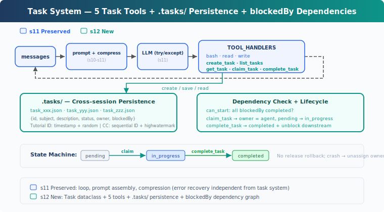
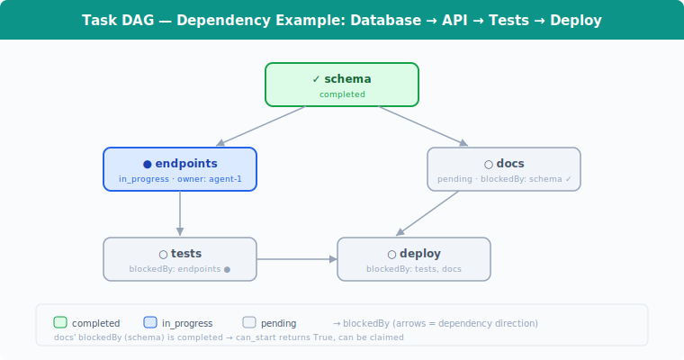

# learning12: Task System — Tasks become persistent state, not just conversation intent

learning01 → ... → learning10 → learning11 → `learning12` → learning13 → ... → learning20
> *'tasks become persistent state, not just conversation intent'* — file-persisted tasks, dependency checks, cross-session recovery.
>
> **Harness Layer**: Tasks — persisted goals, recoverable progress.

---

## The Problem

By learning11, the agent can survive truncation, context overflow, and transient API failures.

But it still treats work as if everything lives only inside the current conversation.

That breaks down on larger projects.

For example, suppose the user asks the agent to:

- set up a database schema
- build API endpoints
- add tests
- write documentation

The agent can keep a temporary checklist in memory, or use the TodoWrite pattern from learning05. But that is still only a checklist for the current run.

It does not give the harness a durable task model:

1. **tasks do not persist across sessions** — if the process stops, the plan disappears
2. **dependencies are implicit** — nothing stops the agent from trying tests before endpoints, or endpoints before schema
3. **progress is not recoverable from disk** — a later run cannot inspect structured task state and continue cleanly

What is missing is a task system: each task stored on disk, each task with explicit dependency state, and a small set of task operations the agent can call while it works.

---

## The Solution



learning12 adds a persistent task layer on top of the learning11 agent.

Instead of treating work as free-form intent inside the transcript, the harness now stores tasks as JSON files under `.tasks/` and exposes task operations through tools.

The teaching version keeps the model simple:

| Capability | learning12 approach |
|-----------|----------------------|
| persistence | one JSON file per task in `.tasks/` |
| dependencies | `blockedBy` list |
| coordination | `owner` field when claimed |
| lifecycle | `pending` → `in_progress` → `completed` |
| recovery | read `.tasks/` again on the next run |

This is the key shift:

**TodoWrite tracks what the agent plans to do right now. Task System tracks durable work state that survives the current conversation.**

---

## How It Works



### Task: Persisted data structure

Each task is stored as a JSON file in `.tasks/`:

```python
@dataclass
class Task:
	id: str
	subject: str
	description: str
	status: str          # pending | in_progress | completed
	owner: str | None    # agent name
	blockedBy: list[str] # upstream dependency task IDs
```

This is intentionally small.

A task needs just enough structure to answer four questions:

- what is the task?
- what state is it in?
- who is working on it?
- what must finish before it can start?

The teaching version generates IDs from timestamp plus random hex. That is simple, readable, and good enough here.

### create_task: Write the task to disk

Creating a task means building the record and immediately saving it:

```python
def create_task(subject: str, description: str = '', blockedBy: list[str] | None = None) -> Task:
	task = Task(
		id=f'task_{int(time.time())}_{random_hex(4)}',
		subject=subject,
		description=description,
		status='pending',
		owner=None,
		blockedBy=blockedBy or [],
	)
	save_task(task)
	return task
```

That automatic save is important.

The task system is useful only if state survives process restarts, so creation must persist immediately instead of waiting for some later flush step.

### can_start: Check dependency readiness

A task can start only when every task in `blockedBy` is already completed:

```python
def can_start(task_id: str) -> bool:
	task = load_task(task_id)
	for dep_id in task.blockedBy:
		if not _task_path(dep_id).exists():
			return False
		dep = load_task(dep_id)
		if dep.status != 'completed':
			return False
	return True
```

Two details matter here:

1. **missing dependency files count as blocked**
2. **only `completed` unblocks downstream work**

So if `write tests` depends on `create API endpoints`, tests remain blocked until the endpoints task is fully completed.

The teaching version checks dependencies but does not implement cycle detection. So it behaves like a DAG system, but without full validation logic.

### claim_task: Move work into progress

When the agent begins a task, it claims it:

```python
def claim_task(task_id: str, owner: str = 'agent') -> str:
	task = load_task(task_id)
	if task.status != 'pending':
		return f'Task {task_id} is {task.status}, cannot claim'
	if not can_start(task_id):
		deps = [d for d in task.blockedBy if load_task(d).status != 'completed']
		return f'Blocked by: {deps}'
	task.owner = owner
	task.status = 'in_progress'
	save_task(task)
	return f'Claimed {task_id} ({task.subject})'
```

This does three jobs:

- prevents starting already-started or already-finished work
- enforces dependency order
- records ownership so work can be coordinated

In the teaching version, `claim_task` both assigns the task and marks it `in_progress` in one step.

### complete_task: Mark done and reveal newly unblocked work

When work finishes, the task moves to `completed`:

```python
def complete_task(task_id: str) -> str:
	task = load_task(task_id)
	task.status = 'completed'
	save_task(task)
	unblocked = [
		t.subject for t in list_tasks()
		if t.status == 'pending' and t.blockedBy and can_start(t.id)
	]
	msg = f'Completed {task_id} ({task.subject})'
	if unblocked:
		msg += f'\nUnblocked: {', '.join(unblocked)}'
	return msg
```

The useful part is not just setting the status.

It also scans for pending tasks that have now become startable. That gives the agent immediate visibility into what work opened up next.

If `schema` completes, then tasks like `endpoints` and `docs` may become unblocked right away.

### get_task and list_tasks: Recover state later

The task system needs read access as much as write access.

- `list_tasks` gives a compact overview of all tasks
- `get_task` returns the full JSON for one task

For example:

```python
def get_task(task_id: str) -> str:
	task = load_task(task_id)
	return json.dumps(asdict(task), indent=2)
```

This is what makes cross-session recovery possible.

A later run does not need to guess what was happening. It can inspect `.tasks/`, read current statuses, and continue from real stored state.

### Task lifecycle: Simple, explicit state machine

The lifecycle is deliberately small:

```text
pending ──claim──→ in_progress ──complete──→ completed
```

That gives three stable states:

- `pending` — known work, not started
- `in_progress` — currently being worked on
- `completed` — finished and available to unblock dependents

This is enough to demonstrate durable work tracking without introducing extra release, retry, or cancellation states.

### Putting it together

A typical flow looks like this:

```python
schema = create_task('setup database schema')
endpoints = create_task('create API endpoints', blockedBy=[schema.id])
tests = create_task('write tests', blockedBy=[endpoints.id])
docs = create_task('write docs', blockedBy=[schema.id])

claim_task(schema.id)
complete_task(schema.id)

claim_task(endpoints.id)
complete_task(endpoints.id)

claim_task(docs.id)
complete_task(docs.id)

claim_task(tests.id)
complete_task(tests.id)
```

And every one of those state changes is written to disk.

So if the process exits after completing `schema`, the next run can still see that `endpoints` and `docs` are now available while `tests` remains blocked.

---

## Changes From learning11

| Component | Before (learning11) | After (learning12) |
|-----------|-------------|-------------|
| work tracking | conversation intent only | persisted task records |
| new types | — | `Task` |
| storage | none for tasks | `.tasks/{id}.json` |
| dependencies | implicit only | `blockedBy` + `can_start` |
| tools | bash, read_file, write_file (3) | + create_task, list_tasks, get_task, claim_task, complete_task (8) |
| lifecycle | none | `pending` → `in_progress` → `completed` |

---

## Try It

```sh
cd learn-claude-code
python learning12_task_system/code.py
```

What to watch for:

1. Creating tasks should generate JSON files under `.tasks/`
2. Claiming a blocked task should fail with a dependency message
3. Completing an upstream task should reveal newly unblocked tasks
4. Restarting and listing tasks should preserve prior progress

Try these prompts:

1. `Create tasks: setup database schema, create API endpoints depends on schema, write tests depends on endpoints, write docs depends on schema`
2. `List all tasks and their statuses`
3. `Claim the first unblocked task and complete it`
4. `List tasks again and tell me which ones are now unblocked`

---

## What's Next

The harness can now persist work as structured task state.

But some tasks are slow. Running tests, waiting on builds, or performing long operations should not block the entire agent loop.

learning13 Background Tasks → slow work moves off the foreground path, while the harness keeps tracking progress.

<details>
<summary>Deep Dive Into CC Source Code</summary>

> The following is based on analysis of CC source code `utils/tasks.ts`, `tools/TaskCreateTool/TaskCreateTool.ts`, `tools/TaskUpdateTool/TaskUpdateTool.ts`, `tools/TaskGetTool/TaskGetTool.ts`, `tools/TaskListTool/TaskListTool.ts`, and `hooks/useTaskListWatcher.ts`.

### Task fields in CC are richer than the teaching version

The tutorial keeps only the fields needed to explain the task model.

CC's task records include additional fields like:

- `activeForm`
- `blocks`
- `metadata`

So the production version supports richer display and graph management, while the teaching version keeps only the essentials.

### Task System and TodoWrite are separate systems

In CC, task tracking and TodoWrite-style planning are not the same feature.

TodoWrite tracks immediate execution steps.
Task System tracks durable, shareable, dependency-aware work.

That separation is the main design point learning12 is trying to show.

### Real CC adds concurrency protections

The teaching version writes JSON files directly.

Production systems need stronger coordination, especially if multiple agents may claim tasks at the same time. CC adds locking and more careful state transitions to avoid race conditions.

### Why this belongs in the harness

Task persistence is not a prompt trick.
It is infrastructure.

It belongs in the harness because the harness is what can:

- write task state to disk
- enforce dependencies
- expose task operations as tools
- recover progress on the next run

</details>
