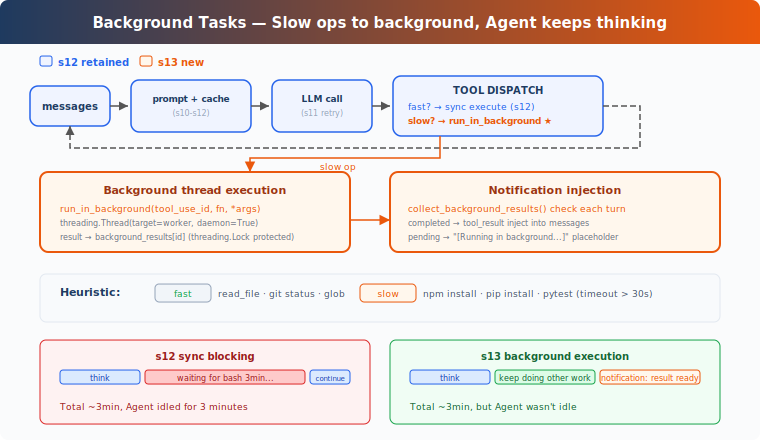

# learning13: Background Tasks — Slow operations go to the background

learning01 → ... → learning11 → learning12 → `learning13` → [learning14](../learning14_cron_scheduler/) → learning15 → ... → learning20
> *'slow operations go to the background'* — run long tool calls asynchronously and inject completion notifications later.
>
> **Harness Layer**: Background execution — long-running work does not block the main loop.

---

## The Problem

By learning12, the agent has a persistent task system and can keep structured work state across sessions.

But tool execution is still fully synchronous.

That is fine for fast commands like:

- `git status`
- reading a file
- listing a directory

Those return quickly, so blocking is not a big deal.

But some commands are slow:

- `pip install torch`
- `npm install`
- `npm run build`
- `pytest`

If the harness waits for each slow command to finish before doing anything else, the agent sits idle for long stretches.

That creates two problems:

1. **the loop is blocked by slow operations** — the agent cannot continue with other useful work
2. **latency is wasted** — long-running shell commands consume time while the model could have been progressing elsewhere

What is missing is a background execution path: let slow operations keep running, return control to the loop immediately, and notify the agent when the work finishes.

---

## The Solution



learning13 keeps the learning12 loop and task-oriented structure, but changes how long-running tool calls are executed.

Instead of forcing every tool call to complete inline, the harness now supports a second execution mode:

| Mode | Behavior |
|------|----------|
| synchronous | run now, return result immediately |
| background | start work now, return a placeholder, deliver result later |

The teaching version uses two signals to decide whether a command should run in the background:

1. **explicit model request** via `run_in_background`
2. **heuristic fallback** for commands that look slow

The key shift is:

**tool results no longer have to arrive in the same turn that started the work.**

A background task can begin in one turn and finish in a later turn through a notification.

---

## How It Works

### should_run_background: Prefer explicit intent

The main decision point is whether a tool call should execute inline or in the background.

The model can request background execution directly through the bash tool input. If it does not, the teaching version falls back to a simple keyword heuristic:

```python
def is_slow_operation(tool_name: str, tool_input: dict) -> bool:
	if tool_name != 'bash':
		return False
	cmd = tool_input.get('command', '').lower()
	slow_keywords = [
		'install', 'build', 'test', 'deploy', 'compile',
		'docker build', 'pip install', 'npm install',
		'cargo build', 'pytest', 'make',
	]
	return any(kw in cmd for kw in slow_keywords)


def should_run_background(tool_name: str, tool_input: dict) -> bool:
	if tool_input.get('run_in_background'):
		return True
	return is_slow_operation(tool_name, tool_input)
```

This ordering matters.

The explicit model request is the primary path. The heuristic is only a fallback for the teaching version so the concept still works even if the model does not set the flag.

### start_background_task: Run work in a daemon thread

When a tool call should run in the background, the harness wraps the execution in a worker function and starts a daemon thread.

State is tracked in in-memory dictionaries keyed by a generated background ID:

```python
_bg_counter = 0
background_tasks: dict[str, dict] = {}
background_results: dict[str, str] = {}
background_lock = threading.Lock()


def start_background_task(block) -> str:
	global _bg_counter
	_bg_counter += 1
	bg_id = f'bg_{_bg_counter:04d}'

	def worker():
		result = execute_tool(block)
		with background_lock:
			background_tasks[bg_id]['status'] = 'completed'
			background_results[bg_id] = result

	with background_lock:
		background_tasks[bg_id] = {
			'tool_use_id': block.id,
			'command': block.input.get('command', ''),
			'status': 'running',
		}

	thread = threading.Thread(target=worker, daemon=True)
	thread.start()
	return bg_id
```

The important behavior is not the thread itself. It is the lifecycle split:

- the original tool call gets an immediate placeholder response
- the actual command output is stored for later delivery
- the main loop continues instead of waiting

The teaching version keeps all state in memory. That is enough to demonstrate the mechanism clearly.

### collect_background_results: Convert finished work into notifications

Completed background work is turned into notification messages on later turns:

```python
def collect_background_results() -> list[str]:
	with background_lock:
		ready_ids = [
			bid for bid, task in background_tasks.items()
			if task['status'] == 'completed'
		]

	notifications = []
	for bg_id in ready_ids:
		with background_lock:
			task = background_tasks.pop(bg_id)
			output = background_results.pop(bg_id, '')
		notifications.append(
			f'<task_notification>\n'
			f'  <task_id>{bg_id}</task_id>\n'
			f'  <status>completed</status>\n'
			f'  <command>{task['command']}</command>\n'
			f'  <summary>{output[:200]}</summary>\n'
			f'</task_notification>'
		)
	return notifications
```

This is why background completion does not reuse the original `tool_use_id`.

That original tool call has already been answered with a placeholder `tool_result`. The completion event is a separate piece of information, so it is injected as a notification instead.

### Loop integration: Two execution paths

The tool loop now branches depending on whether execution is synchronous or background:

```python
results = []
for block in response.content:
	if block.type != 'tool_use':
		continue
	if should_run_background(block.name, block.input):
		bg_id = start_background_task(block)
		results.append({
			'type': 'tool_result',
			'tool_use_id': block.id,
			'content': f'[Background task {bg_id} started] Result will be available when complete.',
		})
	else:
		output = execute_tool(block)
		results.append({
			'type': 'tool_result',
			'tool_use_id': block.id,
			'content': output,
		})

user_content = []
bg_notifications = collect_background_results()
if bg_notifications:
	for notif in bg_notifications:
		user_content.append({'type': 'text', 'text': notif})
user_content.extend(results)
messages.append({'role': 'user', 'content': user_content})
```

This gives the agent a clear protocol:

- fast tool calls still behave normally
- slow tool calls return a start acknowledgement
- completed background work appears later as `<task_notification>` text

That means the agent can keep moving while long commands are still running.

### Example flow

A typical interaction now looks like this:

```text
Turn 1:
  LLM → bash 'npm install' with run_in_background=true
  → background task starts as bg_0001
  → tool_result: '[Background task bg_0001 started] ...'
  → LLM continues with other work

Turn 2:
  LLM → read_file 'package.json'
  → immediate tool_result with file contents
  → collect_background_results sees bg_0001 finished
  → inject <task_notification> for bg_0001
```

The important outcome is that `npm install` did not freeze the loop.

The agent kept making progress while the install was still running.

---

## Changes from learning12

| Component | Before | After |
|-----------|--------|-------|
| execution model | all tool calls synchronous | slow operations may run in background |
| bash input | `command` | `command` + `run_in_background` |
| new functions | none | `is_slow_operation`, `should_run_background`, `start_background_task`, `collect_background_results` |
| new state | none | background task and result maps plus a lock |
| result delivery | immediate only | immediate placeholder + later notification |
| loop behavior | execute and wait | execute inline or dispatch async |

---

## Try It

```sh
cd learn-claude-code
python learning13_background_tasks/code.py
```

Try prompts like:

1. `Run pip list in the background and find all Python files in this directory`
2. `Run npm install in the background, then read package.json while waiting`
3. `Start a long build, then inspect the repo structure before it finishes`

What to observe:

- does the tool return a background task ID immediately?
- does the agent keep working instead of waiting?
- does completion arrive later as a `<task_notification>` message?

---

## What's Next

Background tasks solve one kind of waiting: long operations that should not block the loop.

But sometimes you do not want to run something now at all. You want to run it later, on a schedule.

learning14 Cron Scheduler → give the agent an alarm clock.

<details>
<summary>Deep Dive into CC Source</summary>

> The following is a complete analysis based on CC source code `query.ts`, `services/toolUseSummary/toolUseSummaryGenerator.ts`, `LocalShellTask.tsx`, `messageQueueManager.ts`, and `utils/task/framework.ts`.

### 1. Background summaries and side work

CC starts a side query after tool execution to generate short tool-use summaries for clients. That work happens independently of the main response stream, so consumers can display concise progress updates.

### 2. Event-loop background model

CC does not use Python threads for this. It runs on a JavaScript event loop, so background shell work means starting subprocesses without awaiting them and tracking their output separately.

### 3. Multiple background task types

The production system supports several background task categories, not just local shell commands. Each has its own registration and lifecycle rules.

### 4. Notification injection

When background work completes, CC enqueues a structured notification that is injected into a later turn. The general shape matches the teaching idea:

```xml
<task_notification>
  <status>completed</status>
  <summary>Background command 'npm test' completed (exit code 0)</summary>
</task_notification>
```

### 5. Stall detection

Background shell tasks include watchdog logic to detect commands that stop producing output and may be stuck on interactive prompts.

### 6. Concurrency

Foreground tool use has explicit concurrency limits. Background subprocesses are managed separately and can continue independently of the main turn loop.

</details>

<!-- translation-sync: en@v1, ja@v1 -->
