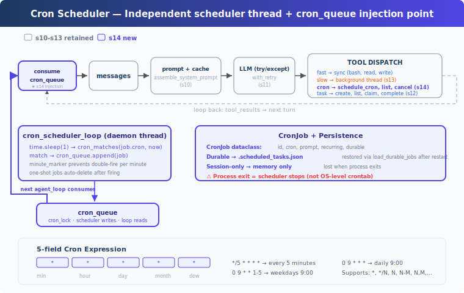

# learning14: Cron Scheduler — Produce work on a schedule, not only on demand

learning01 → ... → learning12 → learning13 → `learning14` → learning15 → ... → learning20
> *'produce work on a schedule, not only on demand'* — cron scheduling, durable or session-level.
>
> **Harness Layer**: Scheduling — a background scheduler thread produces future work and delivers it when the agent is idle.

---

## The Problem

By learning13, the agent can run slow work in the background.

That solves one kind of waiting: long operations no longer block the main loop.

But every action still has to begin with a prompt from the user.

The flow is still:

- user asks for something
- the agent decides what to do
- the harness runs the work now

That is fine for one-off requests.

But some tasks should happen later, or happen repeatedly, without a human having to remember each time.

For example:

- run a status check every 30 minutes
- remind the agent to inspect build output in 10 minutes
- trigger a maintenance prompt every day at 9:00
- schedule a one-time follow-up after a long background task

Without a scheduler, the harness has three limitations:

1. **all work is user-triggered** — nothing new enters the system unless someone types a message
2. **future work has no durable representation** — the agent cannot reliably register a task for later execution
3. **time and execution are tightly coupled** — the loop can act only on what is happening right now, not on what should happen at a later time

What is missing is a scheduling layer: a way to register future prompts, check when they should fire, queue them safely, and deliver them into the agent loop when the time arrives.

---

## The Solution



learning14 extends learning13 with a cron scheduler.

Instead of only reacting to immediate user input, the harness can now register scheduled jobs that produce future agent work.

The teaching version keeps the design simple:

| Capability | learning14 approach |
|-----------|----------------------|
| schedule format | standard 5-field cron expressions |
| trigger source | background scheduler thread |
| delivery path | queue of fired cron jobs |
| execution | delivered into the normal agent loop |
| persistence | optional durable jobs written to disk |
| scope | durable or session-only |

This is the key shift:

**the harness can now create work based on time, not only on immediate conversation turns.**

That also keeps scheduling and execution cleanly separated:

- the scheduler decides *when* work should fire
- the queue holds fired work until it can be processed
- the normal agent loop decides *how* to respond

---

## How It Works

### Four-layer model

Cron scheduling in the teaching version has four layers:

1. **Scheduler** — a daemon thread wakes up every second and checks whether any jobs match the current time
2. **Queue** — matching jobs are appended to `cron_queue`
3. **Queue processor** — if queued work exists and the agent is idle, it starts a turn
4. **Consumer** — the agent loop consumes queued jobs and injects them as scheduled prompts

This separation matters.

The scheduler does not run the agent directly.
The agent loop does not calculate time matches.
The queue processor does not interpret cron syntax.

Each layer has one small job.

### CronJob: Scheduled work record

Each scheduled task is represented as a `CronJob`:

```python
@dataclass
class CronJob:
	id: str
	cron: str        # '0 9 * * *'
	prompt: str      # text injected when the job fires
	recurring: bool  # True for repeating, False for one-shot
	durable: bool    # True if saved to disk
```

This is intentionally compact.

A scheduled job needs to answer only a few questions:

- which job is this?
- when should it fire?
- what prompt should be injected?
- should it repeat?
- should it survive restart?

The prompt itself is not executed by the scheduler.
It is simply delivered into the normal conversation flow when the time arrives.

### Cron expressions: Standard 5-field time matching

The teaching version uses the standard five cron fields:

```text
minute  hour  day-of-month  month  day-of-week
```

Examples:

```text
* * * * *        every minute
0 9 * * *        every day at 9:00
*/5 * * * *      every 5 minutes
0 9 * * 1-5      weekdays at 9:00
```

Supported field patterns include:

- `*`
- `*/N`
- `N`
- `N-M`
- `N,M,...`

That gives enough expressive power to demonstrate scheduled work without introducing the full complexity of every cron extension.

### cron_matches: Decide whether a job fires now

The central time check is `cron_matches`:

```python
def cron_matches(cron_expr: str, dt: datetime) -> bool:
	fields = cron_expr.strip().split()
	if len(fields) != 5:
		return False
	minute, hour, dom, month, dow = fields
	dow_val = (dt.weekday() + 1) % 7

	m = _cron_field_matches(minute, dt.minute)
	h = _cron_field_matches(hour, dt.hour)
	dom_ok = _cron_field_matches(dom, dt.day)
	month_ok = _cron_field_matches(month, dt.month)
	dow_ok = _cron_field_matches(dow, dow_val)

	if not (m and h and month_ok):
		return False
	if dom == '*' and dow == '*':
		return True
	if dom == '*':
		return dow_ok
	if dow == '*':
		return dom_ok
	return dom_ok or dow_ok
```

The most important semantic detail is the relationship between day-of-month and day-of-week.

When both are constrained, cron uses **OR semantics**.
So a job can fire when either field matches, provided minute, hour, and month also match.

That matches standard cron behavior and is an easy place to accidentally get the logic wrong if you oversimplify the implementation.

### cron_scheduler_loop: Time runs independently of the agent loop

The scheduler itself runs in a daemon thread and polls every second:

```python
def cron_scheduler_loop():
	while True:
		time.sleep(1)
		now = datetime.now()
		minute_marker = now.strftime('%Y-%m-%d %H:%M')
		with cron_lock:
			for job in list(scheduled_jobs.values()):
				try:
					if cron_matches(job.cron, now):
						if _last_fired.get(job.id) != minute_marker:
							cron_queue.append(job)
							_last_fired[job.id] = minute_marker
						if not job.recurring:
							scheduled_jobs.pop(job.id, None)
							if job.durable:
								save_durable_jobs()
				except Exception as e:
					print(f'[cron error] {job.id}: {e}')
```

Several design choices matter here:

- **the scheduler is independent of the main loop** — time continues to be checked even when the agent is not actively processing a user turn
- **polling is once per second** — simple, readable, and accurate enough for minute-based cron matching
- **`minute_marker` prevents duplicate firing within the same minute** — a recurring match should not enqueue the same job over and over during that minute
- **one-shot jobs remove themselves after firing** — they are consumed as schedule definitions, not just as queue items
- **errors are isolated per job** — one malformed or buggy task should not kill the scheduler thread

This is the heart of the feature:

**scheduled work is produced by background infrastructure, not by the active reasoning turn.**

### queue_processor_loop: Deliver scheduled work only when the agent is idle

Once jobs are queued, a separate loop watches for opportunities to deliver them:

```python
def queue_processor_loop():
	while True:
		time.sleep(0.2)
		if not has_cron_queue():
			continue
		if not agent_lock.acquire(blocking=False):
			continue
		try:
			if has_cron_queue():
				run_agent_turn_locked()
		finally:
			agent_lock.release()
```

This processor does not know anything about cron syntax.

Its job is only coordination:

- if no cron work is queued, do nothing
- if the agent is busy, wait
- if cron work exists and the agent is idle, start a turn

That means scheduled work is automatic, but still respects the same turn-based structure as ordinary user-driven work.

### Agent loop integration: Scheduled prompts are injected as messages

The normal agent loop consumes fired jobs from the queue and injects them into the transcript as user-role messages:

```python
fired = consume_cron_queue()
for job in fired:
	messages.append({
		'role': 'user',
		'content': f'[Scheduled] {job.prompt}',
	})
```

That keeps the execution model consistent.

The scheduler does not bypass the agent.
It does not run shell commands directly.
It simply creates new prompt events at the right time.

From the model's point of view, a scheduled job arrives as another piece of incoming work.

### Validation: Bad schedules should fail early

The harness validates cron expressions before registering them:

```python
def schedule_job(cron, prompt, recurring=True, durable=True):
	err = validate_cron(cron)
	if err:
		return err
	# register and save job
```

This matters for reliability.

A bad cron expression should be rejected at creation time, not silently accepted and allowed to break later scheduling behavior.

The teaching version also skips invalid durable tasks during load, so startup remains robust even if persisted data becomes corrupted.

### Durable vs session-only jobs

learning14 supports two persistence modes:

- **durable** — written to `.scheduled_tasks.json` and restored on the next run
- **session-only** — stored only in memory and lost when the process exits

Durable jobs survive restarts of the agent process.
But they do **not** run while the process is stopped.

That distinction is important.

Durability here means:

- the job definition is preserved
- the scheduler will see it again next time the agent starts

It does **not** mean:

- the machine will execute the task while the agent is offline

For true always-on scheduling, you would need external infrastructure such as system cron or another process supervisor.

### Putting it together

A typical lifecycle looks like this:

```text
1. startup
   load_durable_jobs()
   start cron_scheduler_loop thread
   start queue_processor_loop thread

2. register a job
   schedule_cron('*/2 * * * *', 'run date', durable=True)
   → job stored in memory and on disk

3. when the schedule matches
   cron_scheduler_loop sees the match
   → appends the job to cron_queue

4. when the agent is idle
   queue_processor_loop notices queued work
   → starts one agent turn

5. inside the turn
   agent_loop consumes queued jobs
   → injects '[Scheduled] run date'
   → model decides how to respond
```

The important architectural result is that **scheduling, queuing, and execution are all separate concerns**.

That makes the system easier to reason about and easier to extend.

---

## Changes from learning13

| Component | Before | After |
|-----------|--------|-------|
| trigger source | user input only | user input plus scheduler-generated work |
| new type | none | `CronJob` |
| new functions | none | `cron_matches`, `validate_cron`, `schedule_job`, `cancel_job`, `cron_scheduler_loop`, `queue_processor_loop` |
| persistence | tasks + background state only | optional durable cron definitions in `.scheduled_tasks.json` |
| concurrency | background execution threads | plus scheduler and queue-processor threads |
| queueing | background completion notifications | scheduled work queue via `cron_queue` |
| tools | previous learning13 set | plus `schedule_cron`, `list_crons`, `cancel_cron` |

---

## Try It

```sh
cd learn-claude-code
python learning14_cron_scheduler/code.py
```

Try prompts like:

1. `Schedule a task to print the current date every 2 minutes`
2. `List all cron jobs`
3. `Create a one-shot reminder in 1 minute to check the build status`
4. `Cancel the recurring job and verify with list_crons`

What to observe:

- does the scheduler thread keep running independently of user prompts?
- does a matching cron job get queued only once per minute?
- when the agent is idle, does scheduled work trigger a turn automatically?
- is a durable job written to `.scheduled_tasks.json` and restored on restart?

---

## What's Next

The harness can now react to the future as well as the present.

But some work is too large or too parallel for a single agent, even with background execution and scheduling.

The next step is to let one agent delegate work to others.

learning15 Agent Teams → one agent is not enough, so the harness grows teammates and coordination.

<details>
<summary>Deep Dive into CC Source</summary>

> The following is a complete analysis based on CC source code `CronCreateTool.ts`, `cronScheduler.ts`, `cron.ts`, `cronTasks.ts`, `cronTasksLock.ts`, and `useScheduledTasks.ts`.

### 1. Three cron tools

CC exposes three cron tools to the model: create, delete, and list.

The production implementation gates them behind feature flags and environment controls so scheduling can be enabled gradually.

### 2. Durable storage

CC stores durable scheduled tasks in a project-level JSON file under a hidden metadata directory.

Session-only tasks live only in memory.

The production system also uses a lock file to prevent duplicate firing across multiple sessions attached to the same project.

### 3. Scheduler polling

Like the teaching version, CC checks on a one-second interval.

That is frequent enough for minute-granularity cron semantics while keeping the implementation simple.

### 4. Cron semantics

The real system supports the usual cron field forms and keeps local-time interpretation.

It also uses the same important OR behavior for day-of-month and day-of-week when both are constrained.

### 5. Jitter and load control

Production scheduling often needs to avoid thundering-herd behavior.

CC adds jitter so many recurring jobs do not all fire at exactly the same instant.

### 6. Limits and expiry

The real implementation places limits on total scheduled jobs and can auto-expire recurring jobs after a configurable period.

That helps keep long-running sessions from accumulating stale schedules forever.

### 7. Queue integration

When cron work fires in CC, it is enqueued into the same broader command-processing machinery rather than bypassing it.

The teaching version mirrors this with `cron_queue` and `queue_processor_loop`, which preserves the core architectural idea even though the implementation is much smaller.

</details>
