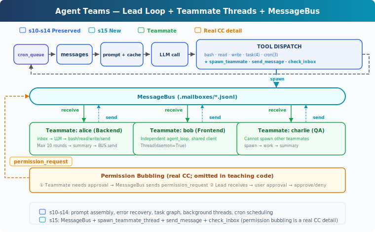
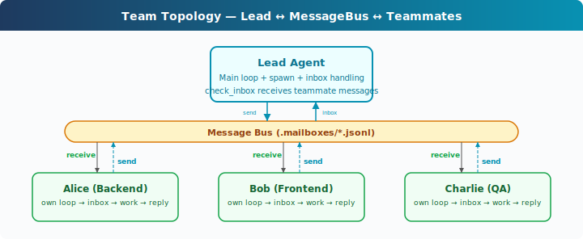

# learning15: Agent Teams — One agent is not enough, so form a team

learning01 → ... → learning13 → learning14 → `learning15` → learning16 → ... → learning20
> *'one agent is not enough, so form a team'* — file-based inboxes and teammate threads.
>
> **Harness Layer**: Teams — multi-agent collaboration through a message bus.

---

## The Problem

By learning14, the harness can manage persistent tasks, run slow work in the background, and schedule future work with cron.

But all of that work still belongs to a single agent loop.

That is enough for focused tasks.

It is not enough for broader work that naturally splits across roles or code areas.

For example:

- one part of the task touches the database schema
- another part needs API route changes
- another part needs tests and validation
- another part needs review of generated files or logs

A single agent can switch between these areas, but it has to keep reloading context.

That creates two problems:

1. **one agent has limited working context** — large, multi-part tasks compete for attention inside one transcript
2. **parallel collaboration is missing** — the harness cannot give separate parts of the job to persistent teammates that report back asynchronously

learning06 introduced subagents, but those were short-lived helpers.

Some work needs something more durable:

- multiple agents with their own loops
- a way to send messages between them
- a lead agent that coordinates the team

What is missing is a team layer: persistent teammates, inbox-based communication, and a coordination model for multi-agent work.

---

## The Solution



learning15 extends learning14 with agent teams.

Instead of a single agent doing everything, the harness can now spawn teammate agents that run in their own threads and communicate through file-based inboxes.

The teaching version keeps the mechanism intentionally small:

| Capability | learning15 approach |
|-----------|----------------------|
| coordination model | one lead agent plus multiple teammates |
| communication path | file-based inboxes via a message bus |
| teammate runtime | daemon thread per teammate |
| delivery model | asynchronous messages injected into the lead's history |
| teammate tools | reduced tool set focused on doing assigned work |
| lifecycle | bounded multi-turn teammate loop |

This is the key shift:

**the harness can now divide work across multiple persistent agents instead of forcing all reasoning through one loop.**

That separation matters:

- the lead coordinates and delegates
- teammates work independently
- messages carry results and follow-up requests back across the team

---

## How It Works



### Four-layer model

The teaching version has four main layers:

1. **Lead agent** — receives the main user request and decides whether to delegate
2. **Message bus** — stores inter-agent messages in per-agent inbox files
3. **Teammate threads** — each teammate runs its own loop with its own messages and tools
4. **Inbox injection** — messages back to the lead are injected into the normal conversation flow

This keeps responsibilities clear.

The message bus does not decide what work to do.
The lead does not directly execute teammate reasoning.
A teammate does not need shared in-memory transcript state with the lead.

Each part has one small job.

### MessageBus: File-based inboxes

Every agent has an inbox file.

Sending a message means appending one JSON record to the recipient's inbox.
Reading an inbox means loading its messages and consuming them.

A simplified version looks like this:

```python
class MessageBus:
	def send(self, from_agent: str, to_agent: str, content: str, msg_type: str = 'message'):
		msg = {
			'from': from_agent,
			'to': to_agent,
			'content': content,
			'type': msg_type,
			'ts': time.time(),
		}
		inbox = MAILBOX_DIR / f'{to_agent}.jsonl'
		with open(inbox, 'a') as f:
			f.write(json.dumps(msg) + '\n')

	def read_inbox(self, agent: str) -> list[dict]:
		inbox = MAILBOX_DIR / f'{agent}.jsonl'
		if not inbox.exists():
			return []
		msgs = [json.loads(line) for line in inbox.read_text().splitlines()]
		inbox.unlink()
		return msgs
```

The teaching version uses files because they are easy to understand and easy to inspect from outside the process.

This gives the team a simple message transport with visible state:

- each recipient has a dedicated inbox
- send is append-only
- receive is explicit consumption

The tradeoff is that the teaching version is not fully hardened for concurrent access.
That is acceptable here because the goal is to teach the architecture, not perfect every edge case.

### spawn_teammate_thread: A teammate gets its own loop

The lead creates teammates through a spawn tool.

Each teammate runs in its own daemon thread with:

- its own system prompt
- its own message history
- its own reduced tool set
- its own inbox polling step

A simplified structure looks like this:

```python
def spawn_teammate_thread(name: str, role: str, prompt: str) -> str:
	system = f'You are {name!r}, a {role}. Use tools to complete tasks.'

	def run():
		messages = [{'role': 'user', 'content': prompt}]
		sub_tools = [bash, read_file, write_file, send_message]
		for _ in range(10):
			inbox = BUS.read_inbox(name)
			if inbox:
				messages.append({
					'role': 'user',
					'content': f'<inbox>{json.dumps(inbox)}</inbox>',
				})
			response = client.messages.create(
				model=MODEL,
				system=system,
				messages=messages[-20:],
				tools=sub_tools,
				max_tokens=8000,
			)
			# execute tools and continue loop
		BUS.send(name, 'lead', summary, 'result')

	threading.Thread(target=run, daemon=True).start()
	return name
```

Several design choices matter here:

- **teammates are persistent across multiple turns** — they are not just one-shot helpers
- **each teammate has an isolated transcript** — that keeps local reasoning focused
- **the tool set is deliberately smaller** — the teaching version emphasizes communication and delegated work, not every possible harness feature
- **the loop is bounded** — a fixed round limit keeps the example small and avoids runaway behavior
- **a final report goes back to the lead** — delegated work becomes visible again through the inbox

This is the core change from subagents:

**a teammate is a continuing collaborator, not just a temporary function call.**

### Lead inbox injection: Messages become new work for the lead

The lead does not share a live transcript with teammates.
Instead, teammate messages are polled from the lead inbox and injected into the lead's history.

A simplified version looks like this:

```python
inbox = BUS.read_inbox('lead')
if inbox:
	inbox_text = '\n'.join(
		f"From {m['from']}: {m['content'][:200]}" for m in inbox
	)
	history.append({
		'role': 'user',
		'content': f'[Inbox]\n{inbox_text}',
	})
```

This keeps the execution model consistent with earlier learnings.

The lead still reacts to incoming messages through the normal agent loop.
Nothing bypasses the transcript.

From the model's point of view, teammate updates arrive as new incoming work.

That means the lead can:

- review teammate progress
- send follow-up instructions
- combine multiple teammate results
- continue the main task with richer distributed context

### Team topology: One lead, many teammates

The simplest team shape is:

- one lead agent
- zero or more named teammates
- messages flowing through inboxes

A typical pattern looks like this:

```text
user request
→ lead decides the task is too broad for one agent
→ lead spawns alice for schema work
→ lead spawns bob for testing work
→ alice and bob run independently in parallel
→ both send results back to lead
→ lead integrates the results and decides next steps
```

The important result is parallelism with coordination.

The lead does not need to fully finish alice's work before starting bob's.
Each teammate can progress independently and report back asynchronously.

### Simplified communication model

The teaching version keeps communication intentionally small.

Typical message types include:

- normal text messages
- result summaries back to the lead

That is enough to show the central architectural point:

**the team needs a transport layer for agent-to-agent communication, and inbox files provide that layer.**

A production system can add richer structured message types later, such as:

- permission requests
- shutdown requests
- task assignments
- plan reviews

But the teaching version does not need all of those to demonstrate the concept.

### Putting it together

A typical lifecycle looks like this:

```text
1. user asks for a broad task
   lead receives the request

2. lead delegates
   spawn_teammate('alice', 'backend developer', 'create schema.sql')
   spawn_teammate('bob', 'tester', 'inspect schema.sql and validate it')

3. teammates work independently
   alice uses tools and writes files
   bob reads files and checks outputs

4. teammates report back
   BUS.send('alice', 'lead', 'schema created', 'result')
   BUS.send('bob', 'lead', 'schema validated', 'result')

5. lead consumes inbox messages
   inbox messages are injected into lead history
   lead decides how to continue
```

The architectural result is that **delegation, communication, and execution are separated concerns**.

That makes team behavior easier to reason about and easier to extend.

---

## Changes from learning14

| Component | Before | After |
|-----------|--------|-------|
| agent count | one agent loop | one lead plus teammate threads |
| communication | none between agents | file-based inbox messaging |
| new abstractions | cron scheduler and queueing | `MessageBus`, teammate registry, inbox consumption |
| new functions | scheduler-related functions | `spawn_teammate_thread`, message send/read helpers, inbox integration |
| tool surface | lead-only single-agent tools | lead delegation tools plus teammate communication tools |
| execution model | one agent handles all work | work may be delegated across multiple agents |

---

## Try It

```sh
cd learn-claude-code
python learning15_agent_teams/code.py
```

Try prompts like:

1. `Spawn alice as a backend developer and ask her to create schema.sql with a users table`
2. `Check your inbox for alice's result`
3. `Spawn bob as a tester and ask him to verify schema.sql and summarize what he finds`
4. `Use two teammates for different parts of the same task and compare their reports`

What to observe:

- does the lead create teammates with separate roles?
- do inbox files appear under the mailbox directory?
- do teammates send results back asynchronously?
- are inbox messages injected into the lead's history as new work?

---

## What's Next

The harness can now coordinate multiple agents instead of relying on only one.

But once agents can communicate, they also need conventions for how to do so safely and predictably.

The next step is to define team protocols for things like shutdown, structured requests, and coordination rules.

learning16 Team Protocols → teammates need shared communication rules, not just a shared bus.
