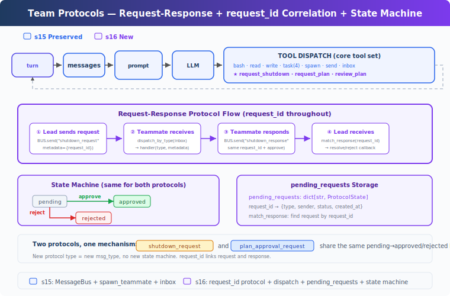

# learning16: Team Protocols — Teammates need agreements, not just a shared bus

learning01 → ... → learning14 → learning15 → `learning16` → learning17 → ... → learning20
> *'teammates need agreements, not just a shared bus'* — request-response protocols for safe multi-agent coordination.
>
> **Harness Layer**: Protocols — structured handshakes between agents.

---

## The Problem

By learning15, the harness can spawn persistent teammates and let them communicate through inbox files.

That is enough for basic delegation.

It is not enough for reliable coordination.

If agents can only send plain text messages, then important interactions become ambiguous.

For example:

- the lead wants a teammate to shut down cleanly
- a teammate wants approval before making a risky change
- the lead needs to know whether a request is still pending or already resolved
- a response arrives later and must be matched to the original request

Without a protocol layer, several problems appear:

1. **requests and replies are loosely connected** — a later message may refer to an earlier one, but the harness has no structured way to correlate them
2. **state is implicit instead of tracked** — there is no durable record that a request is pending, approved, or rejected
3. **message handling is ambiguous** — the same inbox may contain plain text, status updates, and control messages without clear routing rules
4. **safe coordination is harder** — operations like shutdown or plan approval need a handshake, not just a best-effort chat message

learning15 added communication.

What is missing now is a protocol layer:

- structured request and response message types
- request IDs that connect both sides of a handshake
- tracked protocol state
- inbox routing that distinguishes ordinary messages from protocol events

---

## The Solution



learning16 extends learning15 with structured team protocols.

Instead of treating every agent-to-agent message as unstructured text, the harness now supports request-response handshakes with explicit state tracking.

The teaching version keeps the mechanism intentionally small:

| Capability | learning16 approach |
|-----------|----------------------|
| coordination style | request-response handshakes |
| correlation key | `request_id` |
| state tracking | `ProtocolState` records in `pending_requests` |
| inbox handling | dispatch by message type |
| lead-side matching | validate response type before updating state |
| example protocols | shutdown and plan approval |

This is the key shift:

**the harness can now coordinate teammate behavior with explicit protocols instead of relying only on informal text messages.**

That separation matters:

- the message bus transports messages
- the protocol layer defines the handshake rules
- protocol state records what is still unresolved
- inbox consumers update state before handing messages to the model

---

## How It Works


### Four-layer model

The teaching version has four main protocol layers:

1. **Protocol sender** — creates a request, assigns a `request_id`, and stores pending state
2. **Message bus** — delivers the protocol message to the recipient inbox
3. **Inbox dispatcher** — routes incoming protocol messages to the correct handler based on type
4. **Response matcher** — validates the reply and updates pending state

This keeps responsibilities clear.

The message bus does not understand approval logic.
The teammate loop does not search through all pending requests blindly.
The lead does not update request state from raw text guessing.

Each part has one small job.

### ProtocolState: Track unresolved requests

Each protocol request creates a tracked state record.

A simplified version looks like this:

```python
@dataclass
class ProtocolState:
	request_id: str
	type: str
	sender: str
	target: str
	status: str
	payload: str
	created_at: float

pending_requests: dict[str, ProtocolState] = {}
```

This record answers the basic coordination questions:

- which request is this?
- what protocol does it belong to?
- who sent it?
- who should answer it?
- is it still pending or already resolved?
- what payload went with the request?

That is enough to support simple multi-step handshakes without needing a large workflow engine.

### Request-response flow: One ID across the full handshake

The central pattern is:

```text
send request
→ store ProtocolState(status='pending')
→ deliver request message with request_id
→ recipient handles it
→ recipient sends response with same request_id
→ lead matches response and updates state
```

Using shutdown as an example, a simplified flow looks like this:

```python
req_id = new_request_id()
pending_requests[req_id] = ProtocolState(
	request_id=req_id,
	type='shutdown',
	sender='lead',
	target='alice',
	status='pending',
	payload='graceful shutdown',
	created_at=time.time(),
)

BUS.send('lead', 'alice', 'Please shut down cleanly.', 'shutdown_request', {
	'request_id': req_id,
})
```

Then the teammate responds with the same ID:

```python
BUS.send('alice', 'lead', 'Shutting down.', 'shutdown_response', {
	'request_id': req_id,
	'approve': True,
})
```

That single `request_id` is the correlation key across the whole exchange.

### Inbox dispatch: Route by message type

A teammate inbox may contain:

- ordinary messages
- shutdown requests
- plan approval responses
- future protocol types

So the harness dispatches incoming messages by type.

A simplified version looks like this:

```python
def handle_inbox_message(name: str, msg: dict, messages: list[dict]) -> bool:
	msg_type = msg.get('type', 'message')
	meta = msg.get('metadata', {})
	req_id = meta.get('request_id', '')

	if msg_type == 'shutdown_request':
		BUS.send(name, 'lead', 'Shutting down.', 'shutdown_response', {
			'request_id': req_id,
			'approve': True,
		})
		return True

	if msg_type == 'plan_approval_response':
		approve = meta.get('approve', False)
		messages.append({
			'role': 'user',
			'content': '[Plan approved]' if approve else '[Plan rejected]',
		})
		return False

	messages.append({
		'role': 'user',
		'content': f"[Inbox] From {msg.get('from')}: {msg.get('content', '')}",
	})
	return False
```

The important idea is not the exact code.

The important idea is that **protocol messages are handled intentionally, not mixed blindly with ordinary chat text**.

### match_response: Validate before updating state

When the lead receives a response, it should not update any pending request just because the IDs look similar.

It should verify that:

- the request exists
- the request is still pending
- the response type matches the request type

A simplified version looks like this:

```python
def match_response(response_type: str, request_id: str, approve: bool):
	state = pending_requests.get(request_id)
	if not state:
		return
	if state.status != 'pending':
		return
	if state.type == 'shutdown' and response_type != 'shutdown_response':
		return
	if state.type == 'plan_approval' and response_type != 'plan_approval_response':
		return
	state.status = 'approved' if approve else 'rejected'
```

This prevents accidental cross-protocol updates.

A shutdown response should not resolve a plan approval request.

### Unified lead inbox consumption

By learning15, inbox messages could be read in more than one place.

With protocol state in play, that becomes risky.

If one part of the harness consumes a response message before the protocol matcher sees it, the state can become inconsistent.

So learning16 introduces a unified lead inbox consumer that routes protocol responses before returning the messages for transcript injection.

A simplified version looks like this:

```python
def consume_lead_inbox(route_protocol: bool = True) -> list[dict]:
	msgs = BUS.read_inbox('lead')
	if route_protocol:
		for msg in msgs:
			meta = msg.get('metadata', {})
			req_id = meta.get('request_id', '')
			msg_type = msg.get('type', '')
			if req_id and msg_type.endswith('_response'):
				match_response(msg_type, req_id, meta.get('approve', False))
	return msgs
```

That keeps protocol bookkeeping and message delivery aligned.

### Teammate idle loop: Wait for future protocol events

In learning15, teammates had a bounded loop and then exited.

learning16 adds a more realistic behavior: a teammate can become idle and keep polling its inbox.

That matters because some protocol messages arrive after the teammate finishes its initial work.

For example:

- a teammate completes a task
- enters idle waiting
- later receives `shutdown_request`
- replies with `shutdown_response`
- exits cleanly

A simplified lifecycle looks like this:

```text
teammate finishes active work
→ enters idle polling loop
→ checks inbox every second
→ if shutdown_request arrives, respond and exit
→ if a normal message arrives, inject it and continue working
```

This turns protocol handling into an ongoing capability instead of a narrow one-turn trick.

### Two example protocols

The teaching version demonstrates two protocol families.

#### 1. Shutdown protocol

Direction:

- lead → teammate request
- teammate → lead response

Purpose:

- stop a teammate cleanly instead of abruptly killing it

Pattern:

```text
lead sends shutdown_request
→ teammate receives and finishes protocol handler
→ teammate sends shutdown_response
→ lead marks request approved or rejected
```

#### 2. Plan approval protocol

Direction:

- teammate → lead request
- lead → teammate response

Purpose:

- ask for approval before a risky or high-impact action

Pattern:

```text
teammate sends plan_approval_request
→ lead reviews the plan
→ lead sends plan_approval_response
→ teammate sees approved or rejected result
```

The teaching version focuses on the message flow itself.

It does **not** fully gate execution of tools based on plan approval.
That deeper enforcement belongs to a more advanced permission system.

### Putting it together

A typical lifecycle looks like this:

```text
1. lead spawns alice for file work
   alice completes the task and becomes idle

2. lead wants alice to stop
   lead creates request_id req_000142
   lead stores pending ProtocolState(type='shutdown')
   lead sends shutdown_request to alice

3. alice polls inbox
   alice receives shutdown_request
   alice sends shutdown_response with the same request_id
   alice exits cleanly

4. lead consumes inbox
   consume_lead_inbox routes the response
   match_response validates type and request_id
   pending_requests['req_000142'].status becomes 'approved'

5. lead sees the message in transcript
   lead can now report that alice shut down successfully
```

The architectural result is that **communication transport and coordination rules are now separate concerns**.

That makes the team system easier to reason about and easier to extend.

---

## Changes from learning15

| Component | Before | After |
|-----------|--------|-------|
| team communication | plain inbox messaging | plain messaging plus structured protocols |
| request tracking | none | `ProtocolState` and `pending_requests` |
| message routing | mostly generic inbox handling | protocol dispatch by message type |
| response handling | informal interpretation | `request_id` correlation plus type validation |
| teammate lifecycle | bounded work loop | active work plus idle waiting loop |
| shutdown | ad hoc or abrupt termination | graceful shutdown handshake |
| approval flow | none | plan approval request-response example |
| lead inbox handling | inbox reading without protocol matching layer | unified lead inbox consumer with protocol routing |

---

## Try It

```sh
cd learn-claude-code
python learning16_team_protocols/code.py
```

Try prompts like:

1. `Spawn alice as a backend developer, ask her to create a config file, then request her shutdown`
2. `Spawn bob for a risky refactor and have him submit a plan for approval first`
3. `Check your inbox after a teammate replies to a protocol request`
4. `Send a shutdown request to an idle teammate and verify that the response updates request state`

What to observe:

- does each protocol request get a unique `request_id`?
- does the matching response carry the same `request_id` back?
- does `pending_requests` move from `pending` to `approved` or `rejected`?
- are protocol messages routed differently from ordinary inbox messages?
- can an idle teammate still receive and handle a shutdown request?

---

## What's Next

The harness can now run teams and coordinate them with structured handshakes.

But the lead still has to assign work manually.

The next step is to let teammates become more autonomous: discover tasks, claim them, and coordinate with less direct supervision.

learning17 Autonomous Agents → teammates stop waiting for every assignment and begin organizing work themselves.
