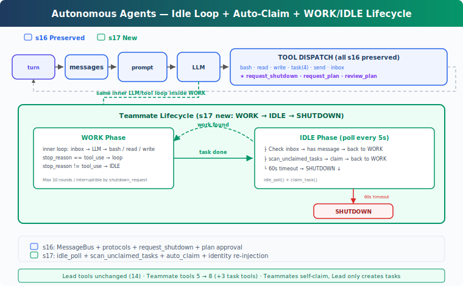

# learning17: Autonomous Agents — Check the board, claim the task

learning01 → ... → learning15 → learning16 → `learning17` → learning18 → ... → learning20
> *'check the board, claim the task'* — poll when idle, work when found.
>
> **Harness Layer**: Autonomy — self-organizing teammates without lead-side assignment.

---

## The Problem

By learning16, teammates can communicate through a shared message bus and participate in structured handshakes like shutdown requests and plan approval.

That is enough for persistent multi-agent coordination.

It is not enough for scalable task execution.

The missing piece is autonomy.

If the lead creates 10 tasks on the board, the lead still has to assign those tasks one by one.

That means the system still depends on manual routing from a central coordinator.

Several limitations follow:

1. **the lead becomes a bottleneck** — every new task needs explicit assignment
2. **idle teammates waste time** — they wait for instructions even when claimable work already exists
3. **dependency-ready tasks are not picked up automatically** — a task may become available after another finishes, but no one notices unless the lead checks again
4. **parallel execution stays underused** — the harness can run multiple teammates, but the work distribution is still mostly manual

learning16 added communication and protocol safety.

What is missing now is self-directed task pickup:

- teammates should look for available work when idle
- teammates should claim unowned tasks themselves
- dependency-unblocked tasks should become runnable without lead intervention
- idle periods should still respect inbox priority and shutdown requests

---

## The Solution



learning17 extends learning16 with autonomous teammate behavior.

Instead of exiting immediately after work or waiting passively for the lead to assign the next task, a teammate now enters an idle phase and checks for claimable work on its own.

The teaching version adds three small ideas:

| Capability | learning17 approach |
|-----------|----------------------|
| idle behavior | poll every 5 seconds while idle |
| task discovery | scan for pending, unowned, dependency-ready tasks |
| task pickup | claim automatically when work is found |

This changes the teammate lifecycle from a single work burst into a repeated cycle:

| Phase | Behavior | Exit condition |
|------|----------|----------------|
| WORK | inbox → model → tool loop | `stop_reason != 'tool_use'` |
| IDLE | poll inbox first, then scan task board | shutdown or timeout |
| SHUTDOWN | send summary and exit | — |

This is the key shift:

**the harness no longer requires the lead to assign every task manually. idle teammates can discover and claim available work for themselves.**

That separation matters:

- the task board stores work state
- teammates search for claimable tasks
- dependency checks decide what can start
- the idle loop keeps protocol handling responsive while waiting

---

## How It Works

### Three-part autonomy loop

The teaching version relies on three pieces working together:

1. **idle polling** — a teammate checks for new inbox messages and new tasks while idle
2. **task scanning** — the harness lists only tasks that are pending, unowned, and dependency-ready
3. **safe claiming behavior** — claim results are checked so failed claims do not look like success

Each piece is small.

Together they let teammates self-organize.

### idle_poll: Stay alive after finishing work

After a teammate completes a task, it does not exit right away.

Instead it enters an IDLE phase and polls periodically for either:

- inbox activity, which has priority
- unclaimed runnable tasks on the task board

A simplified version looks like this:

```python
IDLE_POLL_INTERVAL = 5
IDLE_TIMEOUT = 60

def idle_poll(agent_name, messages, name, role) -> str:
	for _ in range(IDLE_TIMEOUT // IDLE_POLL_INTERVAL):
		time.sleep(IDLE_POLL_INTERVAL)

		inbox = BUS.read_inbox(agent_name)
		if inbox:
			for msg in inbox:
				if msg.get('type') == 'shutdown_request':
					BUS.send(name, 'lead', 'Shutting down.', 'shutdown_response', {
						'request_id': msg.get('metadata', {}).get('request_id', ''),
						'approve': True,
					})
					return 'shutdown'
			messages.append(...)
			return 'work'

		unclaimed = scan_unclaimed_tasks()
		if unclaimed:
			task = unclaimed[0]
			result = claim_task(task['id'], agent_name)
			if 'Claimed' in result:
				messages.append(...)
				return 'work'

	return 'timeout'
```

Two design choices matter here:

- **inbox first** — control messages like `shutdown_request` should be handled before looking for more work
- **claim only on successful result** — finding a task is not the same as owning it

If no work appears and no message arrives, the teammate eventually times out and shuts down cleanly.

### scan_unclaimed_tasks: Filter for work that can actually start

Task discovery should not return every pending task.

It should return only tasks that are truly runnable.

A simplified version looks like this:

```python
def scan_unclaimed_tasks() -> list[dict]:
	unclaimed = []
	for f in sorted(TASKS_DIR.glob('task_*.json')):
		task = json.loads(f.read_text())
		if (
			task.get('status') == 'pending'
			and not task.get('owner')
			and can_start(task['id'])
		):
			unclaimed.append(task)
	return unclaimed
```

The three filters are the whole idea:

- the task must still be `pending`
- the task must not already have an `owner`
- all `blockedBy` dependencies must already be complete

This means a task with dependencies is not permanently blocked.

It becomes visible automatically once those dependencies are resolved.

The teaching version picks the first task in sorted filename order.

That is enough to demonstrate autonomous pickup without introducing a larger scheduler.

### claim_task: Check ownership before switching state

Autonomous claiming only works if failure is explicit.

If two teammates notice the same task at roughly the same time, one of them should fail to claim it instead of silently overwriting the owner.

A simplified version looks like this:

```python
def claim_task(task_id: str, owner: str = 'agent') -> str:
	task = load_task(task_id)
	if task.status != 'pending':
		return f'Task {task_id} is {task.status}, cannot claim'
	if task.owner:
		return f'Task {task_id} already owned by {task.owner}'
	if not can_start(task_id):
		return f'Blocked by: {task.blockedBy}'

	task.owner = owner
	task.status = 'in_progress'
	save_task(task)
	return f'Claimed {task.id} ({task.subject})'
```

The key behavior is simple:

- reject tasks that are no longer pending
- reject tasks that already have an owner
- reject tasks whose dependencies are not resolved
- switch to `in_progress` only after those checks pass

The teaching version still does not use file locks, so races are still possible in principle.

But explicit owner checks avoid the most obvious accidental overwrite behavior.

### WORK → IDLE → SHUTDOWN: Repeated teammate lifecycle

learning16 teammates mostly handled one burst of activity.

learning17 wraps that behavior in an outer lifecycle loop.

A simplified shape looks like this:

```python
while True:
	for _ in range(10):
		...
		if response.stop_reason != 'tool_use':
			break

	idle_result = idle_poll(name, messages, name, role)
	if idle_result == 'shutdown':
		break
	if idle_result == 'timeout':
		break

BUS.send(name, 'lead', summary, 'result')
```

There are two loops with different jobs:

- the **inner loop** handles one WORK phase and caps model-tool rounds
- the **outer loop** alternates between WORK and IDLE until shutdown or timeout

This keeps the teammate persistent without letting it run forever.

### Identity re-injection after compaction

Earlier chapters introduced context compaction.

That creates a small teaching-version problem.

After enough history is compressed, the teammate may no longer have enough local context to remember its own identity and role.

So learning17 re-injects identity when the message history becomes very short:

```python
if len(messages) <= 3:
	messages.insert(0, {
		'role': 'user',
		'content': f"<identity>You are '{name}', role: {role}. Continue your work.</identity>",
	})
```

The exact heuristic is not the lesson.

The lesson is that persistent autonomous loops need to preserve identity across multiple work cycles.

### consume_lead_inbox: Route first, then expose to the model

The lead can only coordinate autonomous teammates effectively if inbox results become part of the lead context.

So learning17 keeps the unified inbox consumption pattern from learning16.

Protocol responses are routed to state first, then all messages are injected into the lead transcript.

That means:

- shutdown responses update tracked protocol state
- teammate summaries become visible to the lead model
- completed work can influence later coordination decisions

Autonomy does not remove the lead.

It removes the need for the lead to micromanage every assignment.

### Putting it together

A typical flow looks like this:

```text
1. lead creates several pending tasks
2. lead spawns alice and bob
3. both teammates enter WORK, then become idle
4. alice polls, finds an unclaimed task, and claims it
5. bob polls, finds another unclaimed task, and claims it
6. alice finishes, returns to IDLE, and discovers newly available work
7. a dependency-blocked task becomes claimable after another task completes
8. teammates keep cycling until no work appears for the idle timeout
9. each teammate sends a final summary and shuts down
```

The important result is that the board itself becomes the coordination surface.

The lead creates work.

Teammates pick it up.

---

## Changes from learning16

| Component | Before | After |
|-----------|--------|-------|
| task assignment | lead assigns tasks manually | teammates scan and auto-claim tasks |
| teammate lifetime | work, then often exit | repeated WORK → IDLE → SHUTDOWN cycle |
| idle behavior | no autonomous polling loop | inbox-first polling every 5 seconds |
| task readiness | mostly discovered by lead decisions | dependency-ready tasks become self-claimable |
| claim behavior | basic claim path | owner-aware claim rejection on conflict |
| lead inbox role | protocol routing and transcript injection | same pattern, now supporting autonomous teammates |
| identity continuity | shorter-lived teammate context | identity re-injection after compaction |
| teammate tools | communication-focused | communication plus task-board pickup |

---

## Try It

```sh
cd learn-claude-code
python s17_autonomous_agents/code.py
```

Try this prompt:

`Create 3 tasks on the board, then spawn alice and bob. Watch them auto-claim and work.`

Things to observe:

- do idle teammates claim unassigned tasks without explicit lead assignment?
- do `blockedBy` tasks stay unclaimed until dependencies are complete?
- after finishing one task, does a teammate return to idle instead of exiting immediately?
- does idle timeout eventually trigger shutdown?
- if a shutdown request arrives during IDLE, is it handled right away?
- how do task files change inside `.tasks/` as ownership and status update?

---

## What's Next

Autonomy improves task pickup.

But it does not solve workspace conflicts.

If two teammates edit the same files in the same directory, they can still interfere with each other.

learning18 introduces worktree isolation so each task gets its own working directory.

<details>
<summary>Deep Dive into CC Source</summary>

> Teaching note: learning17 presents autonomy as a compact idle-polling design. Claude Code uses a richer combination of mechanisms, but the underlying goal is similar: reduce manual lead assignment and let available teammates pick up work safely.

### 1. Idle behavior in CC: several mechanisms working together

The teaching version uses one `idle_poll()` loop.

CC combines multiple mechanisms instead:

- **idle notification** — `sendIdleNotification()` in `inProcessRunner.ts` reports that a teammate is available
- **mailbox polling** — `waitForNextPromptOrShutdown()` checks for messages and shutdown requests on a short interval
- **task watching** — `useTaskListWatcher` reacts to task-list changes and newly unblocked tasks
- **claim attempts while waiting** — the runner also tries to claim available tasks during the idle period

So the real implementation is not one single polling function.

But conceptually it serves the same purpose:

- stay responsive while idle
- detect new work
- prioritize shutdown and control flow
- reduce the need for manual assignment

### 2. Task claiming in CC: lock-protected atomic updates

The teaching version demonstrates ownership checks but not full concurrency safety.

CC goes further.

`claimTask()` in `utils/tasks.ts` uses file locking so read-check-write happens atomically.

That protects several conditions together:

- the task still has no owner
- the task is not already completed
- dependencies in `blockedBy` are all resolved

CC also uses task-list level coordination to avoid race windows between discovering available work and claiming it.

The key lesson is the same:

**autonomous pickup needs an ownership guard, and production systems usually need locks as well.**

### 3. Teaching version and CC: same semantics, different complexity

| Dimension | Teaching version | CC |
|-----------|------------------|----|
| idle mechanism | `idle_poll()` every 5 seconds | notifications, mailbox polling, task watching, claim attempts |
| task discovery | `scan_unclaimed_tasks()` | task watchers plus available-task search |
| dependency check | `can_start()` | unresolved blocker check in task utilities |
| claim safety | owner check | lock-protected atomic claim |
| shutdown during idle | handled directly in poll loop | prioritized in idle wait logic |
| lifetime | 60s idle timeout | no fixed teaching-style timeout |
| identity continuity | manual re-injection heuristic | system prompt persists through compaction |

The teaching chapter intentionally compresses the design so the autonomy pattern stays easy to study.

The important semantic change is simple:

idle teammates do not just wait.
They look for available work and claim it themselves.

</details>

<!-- translation-sync: en@v1 -->
