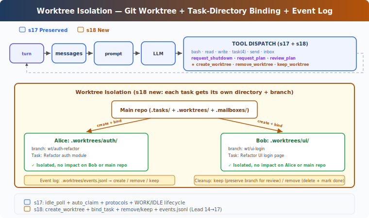

# learning18: Worktree Isolation — Separate directories, no conflicts

learning01 → ... → learning16 → learning17 → `learning18` → learning19 → learning20
> *'separate directories, no conflicts'* — tasks own the goal, worktrees own the directory, bound by ID.
>
> **Harness Layer**: Isolation — parallel execution in separate directories.

---

## The Problem

By learning17, teammates can discover tasks, claim them autonomously, and coordinate through inbox protocols.

That is enough for parallel task execution.

It is not enough for safe parallel file editing.

If two teammates work in the same repository directory at the same time, they can still interfere with each other.

For example:

- alice claims a task to refactor the auth module
- bob claims a task to update the login UI
- both tasks touch shared files like `config.py` or `README.md`
- one teammate writes over the other teammate's uncommitted work
- later it is hard to tell which changes belong to which task

Several limitations follow:

1. **parallel task execution still shares one filesystem view** — all teammates edit in the same working directory
2. **changes from different tasks mix together** — there is no clean directory boundary per task
3. **rollback and review are harder** — task-specific changes are not naturally isolated on separate branches
4. **autonomy increases conflict risk** — once teammates claim tasks on their own, overlapping edits become more likely

learning17 solved who should do work and when they can claim it.

What is missing now is workspace isolation:

- each task should be able to own its own working directory
- teammates should automatically execute tools inside the right directory
- cleanup should be explicit and safe
- worktree names should be validated before touching the filesystem

---

## The Solution



learning18 extends learning17 with git worktree-based isolation.

Instead of having every teammate operate in the same repository directory, the harness can create a separate worktree for a task and bind that worktree to the task record.

The teaching version adds four small ideas:

| Capability | learning18 approach |
|-----------|----------------------|
| isolated directory creation | `create_worktree(name, task_id='')` |
| task-directory binding | `bind_task_to_worktree(task_id, worktree_name)` |
| teammate execution context | switch tool `cwd` after claiming a worktree-bound task |
| cleanup policy | `remove_worktree` or `keep_worktree` after completion |

This is the key shift:

**parallel teammates no longer need to share one mutable working directory. each task can carry its own isolated git worktree.**

That separation matters:

- the task board stores work ownership and status
- the worktree system stores directory isolation
- claiming a task can activate the matching worktree automatically
- cleanup decisions stay explicit instead of being hidden side effects

---

## How It Works

### Four-part isolation model

The teaching version relies on four connected pieces:

1. **worktree creation** — create a directory and branch for a task
2. **task binding** — record which worktree belongs to which task
3. **tool context switching** — run teammate tools in the bound worktree directory
4. **cleanup and audit** — either keep or remove the worktree and log the lifecycle event

Each piece is small.

Together they let autonomous teammates work in separate directories.

### create_worktree: Create directory and branch together

A task can be given its own git worktree.

A simplified version looks like this:

```python
def create_worktree(name: str, task_id: str = '') -> str:
	validate_worktree_name(name)
	path = WORKTREES_DIR / name
	ok, result = run_git(['worktree', 'add', str(path), '-b', f'wt/{name}', 'HEAD'])
	if not ok:
		return f'Git error: {result}'
	if task_id:
		bind_task_to_worktree(task_id, name)
	log_event('create', name, task_id)
	return f"Worktree '{name}' created at {path}"
```

This does three things in sequence:

- validate the requested worktree name
- ask git to create a new worktree and branch
- optionally bind the resulting worktree to a task

The teaching version uses `.worktrees/<name>` and branch names like `wt/<name>`.

That is enough to show the idea without adding more branch-management complexity.

### bind_task_to_worktree: Store directory ownership on the task

Creating a worktree does not automatically mean the task has started.

Instead, the harness records the relationship first:

```python
def bind_task_to_worktree(task_id: str, worktree_name: str):
	task = load_task(task_id)
	task.worktree = worktree_name
	save_task(task)
```

The important rule is:

**binding a task to a worktree does not change the task status.**

The task stays `pending` until a teammate actually claims it.

That matters because it preserves the learning17 task flow:

- the lead can create tasks in advance
- the lead can prepare worktrees in advance
- teammates still discover and claim runnable tasks autonomously
- ownership changes only when claiming succeeds

### Claim-time cwd switching: Tools run inside the right worktree

Once a teammate claims a task that has a bound worktree, later tool calls should execute in that worktree directory instead of the repo root.

A simplified version looks like this:

```python
wt_ctx = {'path': None}

def _run_claim_task(task_id):
	result = claim_task(task_id, owner=name)
	if 'Claimed' in result:
		task = load_task(task_id)
		if task.worktree:
			wt_ctx['path'] = str(WORKTREES_DIR / task.worktree)
	return result

def _run_bash(command):
	return run_bash(command, cwd=wt_ctx['path'])
```

The same idea applies to file tools like `read_file` and `write_file`.

The key behavior is simple:

- claim the task normally
- inspect the task record after a successful claim
- if a worktree is bound, remember that path in teammate-local context
- run later tools relative to that worktree path

This keeps isolation attached to the task lifecycle instead of requiring the model to remember a directory manually.

### validate_worktree_name: Reject unsafe names early

The harness should not allow arbitrary path strings when creating directories.

A simplified rule is:

- allow only letters, numbers, `.`, `_`, and `-`
- reject names like `.` and `..`
- reject path traversal such as `../../tmp/evil`

The teaching version describes this as a slug-style validation step before any git command runs.

That means worktree creation fails early if the name is unsafe.

### remove_worktree and keep_worktree: Explicit cleanup policy

After work finishes, the harness does not silently decide what to do with the directory.

Instead it exposes two explicit actions.

A simplified version looks like this:

```python
def remove_worktree(name: str, discard_changes: bool = False) -> str:
	if not discard_changes:
		files, commits = _count_worktree_changes(path)
		if files > 0 or commits > 0:
			return 'Has uncommitted changes. Use discard_changes=true to force, or keep_worktree'
	ok, _ = run_git(['worktree', 'remove', str(path), '--force'])
	if not ok:
		return 'Remove failed'
	run_git(['branch', '-D', f'wt/{name}'])
	log_event('remove', name)


def keep_worktree(name: str) -> str:
	log_event('keep', name)
	return f"Worktree '{name}' kept for review (branch: wt/{name})"
```

Two design choices matter:

- **safe by default** — removal refuses if there are uncommitted changes unless the caller explicitly forces discard
- **review-friendly** — keeping a worktree preserves the branch and directory for later inspection

Also note what this does **not** do:

- it does not auto-complete the task
- it does not auto-merge the branch
- it does not silently destroy task output

Cleanup and task completion stay separate concerns.

### Event logging: Audit the lifecycle

Each worktree lifecycle action is logged.

A simplified version looks like this:

```python
def log_event(event_type: str, worktree_name: str, task_id: str = ''):
	event = {
		'type': event_type,
		'worktree': worktree_name,
		'task_id': task_id,
		'ts': time.time(),
	}
```

The teaching version logs events such as:

- `create`
- `remove`
- `keep`

That gives the harness a small audit trail for what happened to isolated directories.

It is not a full recovery system.

It is enough to make worktree lifecycle visible and inspectable.

### Putting it together

A typical flow looks like this:

```text
1. lead creates two pending tasks
2. lead creates worktree auth-refactor and binds it to task A
3. lead creates worktree ui-login and binds it to task B
4. lead spawns alice and bob
5. alice claims task A and switches tool cwd to .worktrees/auth-refactor
6. bob claims task B and switches tool cwd to .worktrees/ui-login
7. both teammates edit files without sharing one working directory
8. after completion, the lead keeps one worktree for review and removes the other
9. lifecycle events are recorded in the worktree event log
```

The important result is that task autonomy and filesystem isolation now line up.

The board decides who owns the work.

The worktree decides where that work happens.

---

## Changes from learning17

| Component | Before | After |
|-----------|--------|-------|
| working directory | all teammates share one repo directory | each task can bind to an isolated git worktree |
| task data | id, subject, status, owner, blockedBy | adds `worktree` field |
| teammate execution context | tools run in the main repo cwd | tools switch to worktree cwd after claim |
| new isolation tools | none | `create_worktree`, `bind_task_to_worktree`, `remove_worktree`, `keep_worktree` |
| directory safety | no worktree naming rules | validate names before creation |
| cleanup behavior | not applicable | explicit keep-or-remove policy |
| auditing | no worktree lifecycle log | `create` / `remove` / `keep` event logging |
| autonomy model | claimable tasks, shared filesystem | claimable tasks, isolated filesystems |

---

## Try It

```sh
cd learn-claude-code
python learning18_worktree_isolation/code.py
```

Try this prompt:

`Create two tasks, create a worktree for each with task binding, then spawn alice and bob. Watch them auto-claim and work in isolated directories.`

Things to observe:

- after binding, does the task remain `pending` until a teammate claims it?
- when a teammate claims a worktree-bound task, do later tool calls run in that worktree directory?
- do two worktrees appear as separate branches and directories?
- does `remove_worktree` refuse when uncommitted changes exist?
- if you choose `keep_worktree`, is the branch preserved for review?
- what lifecycle entries appear in the worktree event log?

---

## What's Next

The harness can now run autonomous teammates in isolated directories.

But those teammates still only know the tools built directly into the harness.

What if users want to connect external tools, like internal APIs, custom deployment systems, or third-party integrations?

learning19 introduces MCP plugin support so agents can use tools provided through a standard external protocol.
